# Correct Diagrams — Double Alpha Fitness Gym Management System

Every diagram below is drawn from what the code actually does (backend, frontend and Gesture Engine, commit `d6696bd4`). Diagrams only; the written explanations are not included yet.

**Contents**

1. System Process Flow Diagram (1.1 to 1.7)
2. Context Level Diagram
3. Data Flow Diagram Level 1 (3.1 to 3.10)
4. Use Case Diagram (4.1 to 4.3)
5. Logical Entity-Relationship Diagram
6. Physical Entity-Relationship Diagram

---

## 1. System Process Flow Diagram

### 1.1 Login and navigation

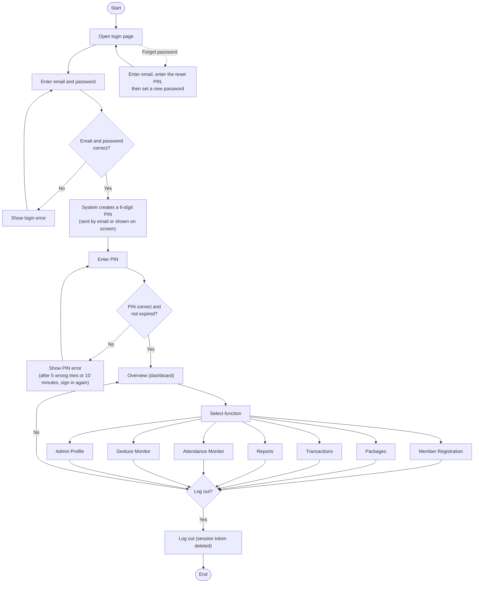
```mermaid
flowchart TD
    Start([Start]) --> Login["Open login page"]
    Login --> Cred["Enter email and password"]
    Cred --> Valid{"Email and password<br/>correct?"}
    Valid -- No --> Err1["Show login error"]
    Err1 --> Cred
    Valid -- Yes --> Pin["System creates a 6-digit PIN<br/>(sent by email or shown on screen)"]
    Pin --> EnterPin["Enter PIN"]
    EnterPin --> PinOk{"PIN correct and<br/>not expired?"}
    PinOk -- No --> Err2["Show PIN error<br/>(after 5 wrong tries or 10 minutes, sign in again)"]
    Err2 --> EnterPin
    PinOk -- Yes --> Dash["Overview (dashboard)"]

    Login -. "Forgot password" .-> Reset["Enter email, enter the reset PIN,<br/>then set a new password"]
    Reset --> Login

    Dash --> Select["Select function"]
    Select --> M1["Member Registration"]
    Select --> M2["Packages"]
    Select --> M3["Transactions"]
    Select --> M4["Reports"]
    Select --> M5["Attendance Monitor"]
    Select --> M6["Gesture Monitor"]
    Select --> M7["Admin Profile"]

    M1 --> Out{"Log out?"}
    M2 --> Out
    M3 --> Out
    M4 --> Out
    M5 --> Out
    M6 --> Out
    M7 --> Out
    Out -- No --> Dash
    Out -- Yes --> Logout["Log out (session token deleted)"]
    Logout --> End([End])
```

### 1.2 Member registration

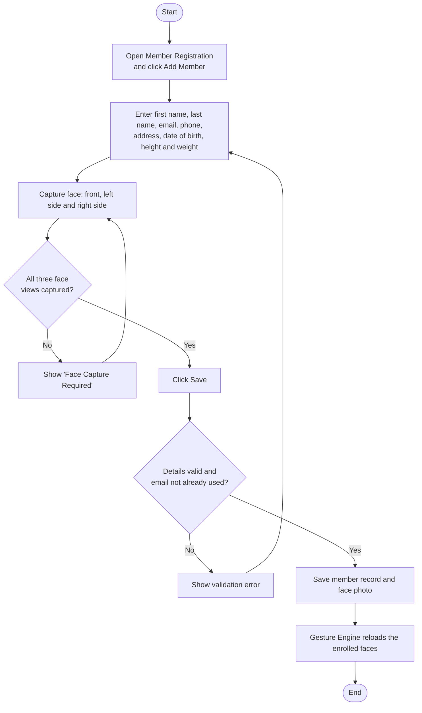
```mermaid
flowchart TD
    A([Start]) --> B["Open Member Registration<br/>and click Add Member"]
    B --> C["Enter first name, last name, email, phone,<br/>address, date of birth, height and weight"]
    C --> D["Capture face: front, left side and right side"]
    D --> E{"All three face<br/>views captured?"}
    E -- No --> F["Show 'Face Capture Required'"]
    F --> D
    E -- Yes --> G["Click Save"]
    G --> H{"Details valid and<br/>email not already used?"}
    H -- No --> I["Show validation error"]
    I --> C
    H -- Yes --> J["Save member record and face photo"]
    J --> K["Gesture Engine reloads the enrolled faces"]
    K --> L([End])
```

### 1.3 Attendance monitoring (automatic)

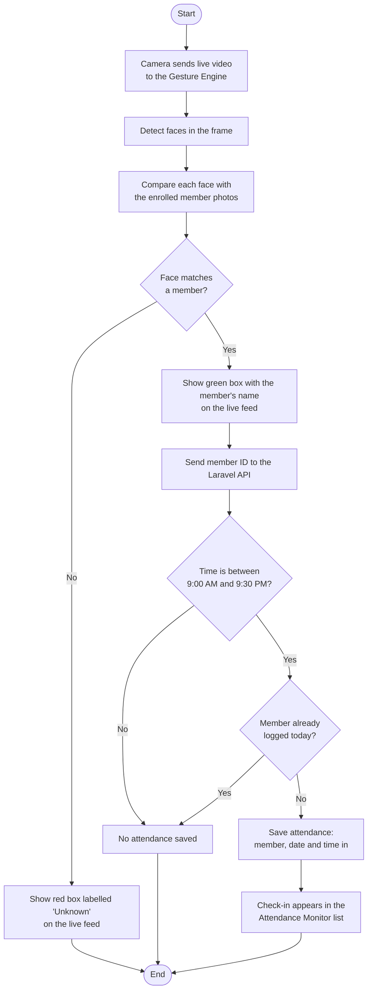
```mermaid
flowchart TD
    A([Start]) --> B["Camera sends live video<br/>to the Gesture Engine"]
    B --> C["Detect faces in the frame"]
    C --> D["Compare each face with<br/>the enrolled member photos"]
    D --> E{"Face matches<br/>a member?"}
    E -- No --> F["Show red box labelled 'Unknown'<br/>on the live feed"]
    F --> Z([End])
    E -- Yes --> G["Show green box with the member's name<br/>on the live feed"]
    G --> H["Send member ID to the Laravel API"]
    H --> I{"Time is between<br/>9:00 AM and 9:30 PM?"}
    I -- No --> X["No attendance saved"]
    I -- Yes --> J{"Member already<br/>logged today?"}
    J -- Yes --> X
    X --> Z
    J -- No --> K["Save attendance:<br/>member, date and time in"]
    K --> L["Check-in appears in the<br/>Attendance Monitor list"]
    L --> Z
```

### 1.4 Program monitoring

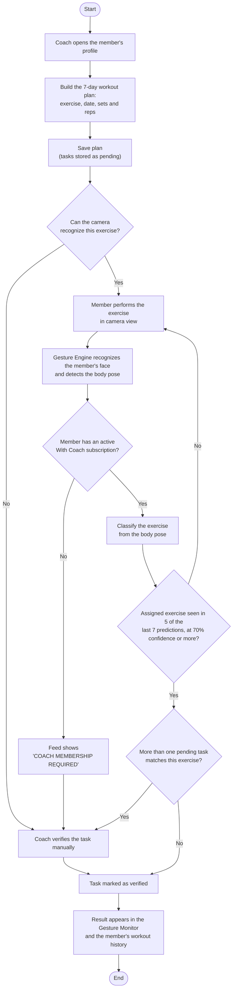
```mermaid
flowchart TD
    A([Start]) --> B["Coach opens the member's profile"]
    B --> C["Build the 7-day workout plan:<br/>exercise, date, sets and reps"]
    C --> D["Save plan<br/>(tasks stored as pending)"]
    D --> E{"Can the camera<br/>recognize this exercise?"}
    E -- No --> M["Coach verifies the task manually"]
    E -- Yes --> F["Member performs the exercise<br/>in camera view"]
    F --> G["Gesture Engine recognizes the member's face<br/>and detects the body pose"]
    G --> H{"Member has an active<br/>With Coach subscription?"}
    H -- No --> N["Feed shows<br/>'COACH MEMBERSHIP REQUIRED'"]
    N --> M
    H -- Yes --> I["Classify the exercise<br/>from the body pose"]
    I --> J{"Assigned exercise seen in 5 of the<br/>last 7 predictions, at 70% confidence or more?"}
    J -- No --> F
    J -- Yes --> K{"More than one pending task<br/>matches this exercise?"}
    K -- Yes --> M
    K -- No --> L["Task marked as verified"]
    M --> L
    L --> O["Result appears in the Gesture Monitor<br/>and the member's workout history"]
    O --> Z([End])
```

### 1.5 Packages and subscriptions

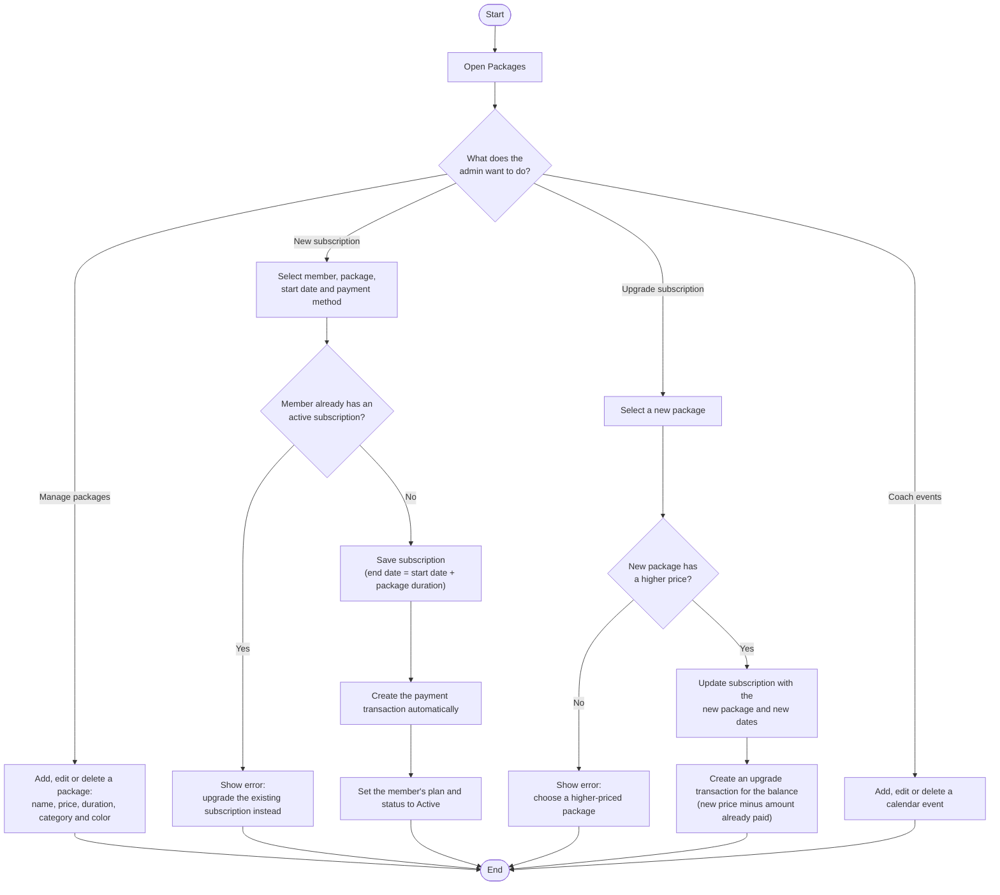
```mermaid
flowchart TD
    A([Start]) --> B["Open Packages"]
    B --> C{"What does the<br/>admin want to do?"}

    C -- "Manage packages" --> D["Add, edit or delete a package:<br/>name, price, duration, category and color"]
    D --> Z([End])

    C -- "New subscription" --> E["Select member, package,<br/>start date and payment method"]
    E --> F{"Member already has an<br/>active subscription?"}
    F -- Yes --> G["Show error:<br/>upgrade the existing subscription instead"]
    G --> Z
    F -- No --> H["Save subscription<br/>(end date = start date + package duration)"]
    H --> I["Create the payment transaction automatically"]
    I --> J["Set the member's plan and status to Active"]
    J --> Z

    C -- "Upgrade subscription" --> K["Select a new package"]
    K --> L{"New package has<br/>a higher price?"}
    L -- No --> P["Show error:<br/>choose a higher-priced package"]
    P --> Z
    L -- Yes --> N["Update subscription with the<br/>new package and new dates"]
    N --> O["Create an upgrade transaction for the balance<br/>(new price minus amount already paid)"]
    O --> Z

    C -- "Coach events" --> Q["Add, edit or delete a calendar event"]
    Q --> Z
```

### 1.6 Payment transactions

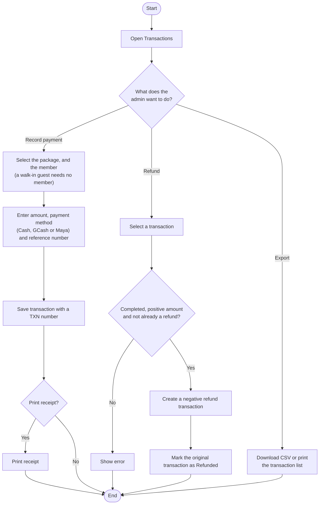
```mermaid
flowchart TD
    A([Start]) --> B["Open Transactions"]
    B --> C{"What does the<br/>admin want to do?"}

    C -- "Record payment" --> D["Select the package, and the member<br/>(a walk-in guest needs no member)"]
    D --> E["Enter amount, payment method<br/>(Cash, GCash or Maya) and reference number"]
    E --> F["Save transaction with a TXN number"]
    F --> G{"Print receipt?"}
    G -- Yes --> H["Print receipt"]
    H --> Z([End])
    G -- No --> Z

    C -- "Refund" --> I["Select a transaction"]
    I --> J{"Completed, positive amount<br/>and not already a refund?"}
    J -- No --> K["Show error"]
    K --> Z
    J -- Yes --> L["Create a negative refund transaction"]
    L --> M["Mark the original transaction as Refunded"]
    M --> Z

    C -- "Export" --> N["Download CSV or print<br/>the transaction list"]
    N --> Z
```

### 1.7 Reports

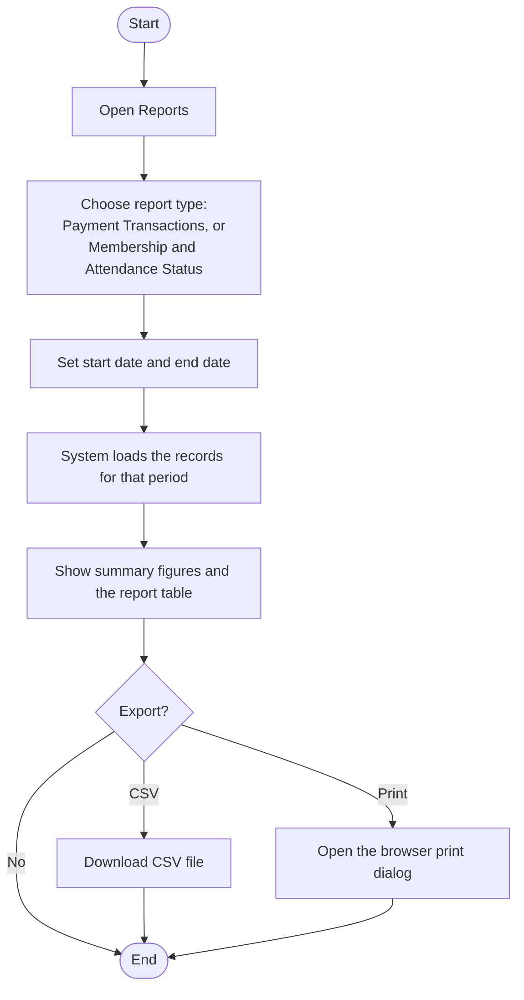
```mermaid
flowchart TD
    A([Start]) --> B["Open Reports"]
    B --> C["Choose report type:<br/>Payment Transactions, or<br/>Membership and Attendance Status"]
    C --> D["Set start date and end date"]
    D --> E["System loads the records for that period"]
    E --> F["Show summary figures and the report table"]
    F --> G{"Export?"}
    G -- CSV --> H["Download CSV file"]
    G -- Print --> I["Open the browser print dialog"]
    G -- No --> Z([End])
    H --> Z
    I --> Z
```

---

## 2. Context Level Diagram

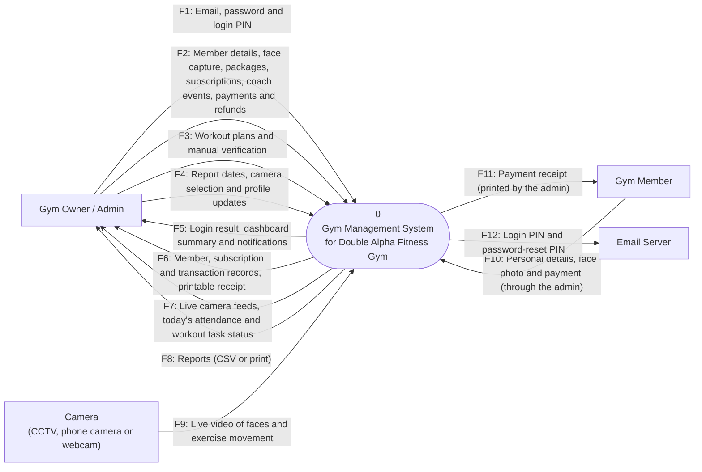
```mermaid
flowchart LR
    Admin["Gym Owner / Admin"]
    Camera["Camera<br/>(CCTV, phone camera or webcam)"]
    Member["Gym Member"]
    Mail["Email Server"]
    System(["0<br/>Gym Management System<br/>for Double Alpha Fitness Gym"])

    Admin -->|"F1: Email, password and login PIN"| System
    Admin -->|"F2: Member details, face capture, packages, subscriptions, coach events, payments and refunds"| System
    Admin -->|"F3: Workout plans and manual verification"| System
    Admin -->|"F4: Report dates, camera selection and profile updates"| System

    System -->|"F5: Login result, dashboard summary and notifications"| Admin
    System -->|"F6: Member, subscription and transaction records, printable receipt"| Admin
    System -->|"F7: Live camera feeds, today's attendance and workout task status"| Admin
    System -->|"F8: Reports (CSV or print)"| Admin

    Camera -->|"F9: Live video of faces and exercise movement"| System
    Member -->|"F10: Personal details, face photo and payment (through the admin)"| System
    System -->|"F11: Payment receipt (printed by the admin)"| Member
    System -->|"F12: Login PIN and password-reset PIN"| Mail
```

Flow F12 applies when email is configured. In local mode the PIN is shown on the screen instead.

---

## 3. Data Flow Diagram Level 1

The Level 1 DFD is drawn as one small figure per process so each one stays readable. Data store numbers (D1 to D14) are the same in every figure.

### 3.1 Process 1.0 — Log In

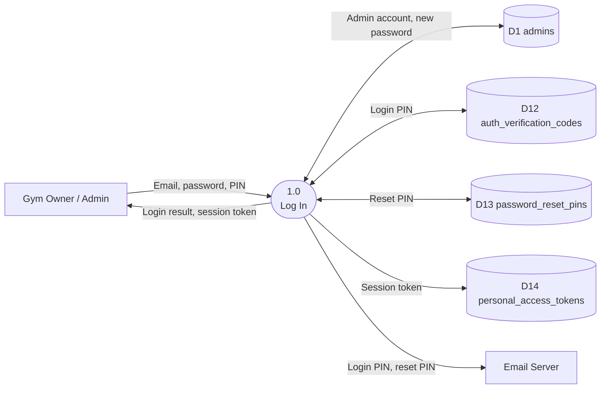
```mermaid
flowchart LR
    Admin["Gym Owner / Admin"]
    Mail["Email Server"]
    P1(["1.0<br/>Log In"])
    D1[("D1 admins")]
    D12[("D12 auth_verification_codes")]
    D13[("D13 password_reset_pins")]
    D14[("D14 personal_access_tokens")]

    Admin -->|"Email, password, PIN"| P1
    P1 -->|"Login result, session token"| Admin
    P1 <-->|"Admin account, new password"| D1
    P1 <-->|"Login PIN"| D12
    P1 <-->|"Reset PIN"| D13
    P1 -->|"Session token"| D14
    P1 -->|"Login PIN, reset PIN"| Mail
```

### 3.2 Process 2.0 — View Dashboard and Notifications

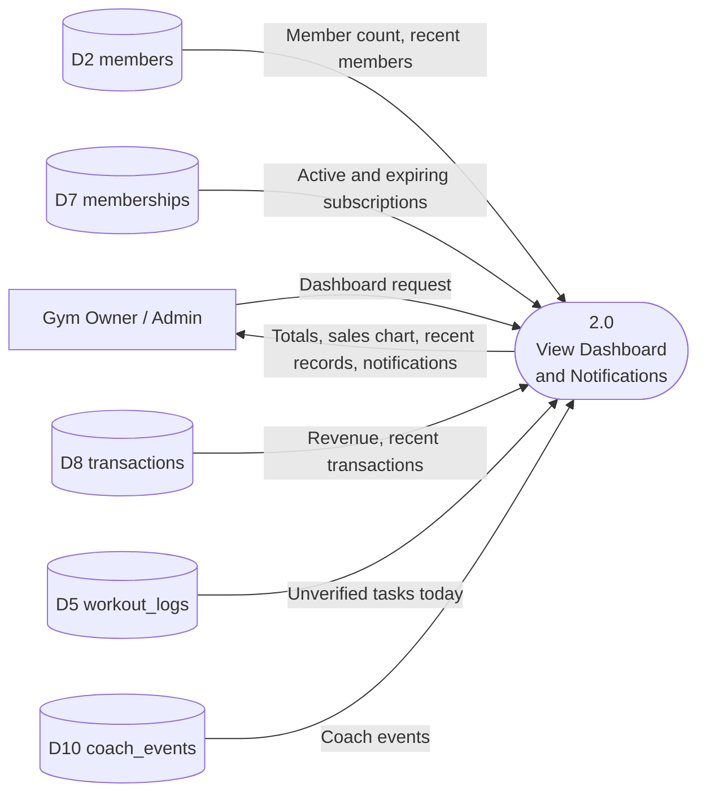
```mermaid
flowchart LR
    Admin["Gym Owner / Admin"]
    P2(["2.0<br/>View Dashboard<br/>and Notifications"])
    D2[("D2 members")]
    D5[("D5 workout_logs")]
    D7[("D7 memberships")]
    D8[("D8 transactions")]
    D10[("D10 coach_events")]

    Admin -->|"Dashboard request"| P2
    P2 -->|"Totals, sales chart, recent records, notifications"| Admin
    D2 -->|"Member count, recent members"| P2
    D7 -->|"Active and expiring subscriptions"| P2
    D8 -->|"Revenue, recent transactions"| P2
    D5 -->|"Unverified tasks today"| P2
    D10 -->|"Coach events"| P2
```

### 3.3 Process 3.0 — Manage Members

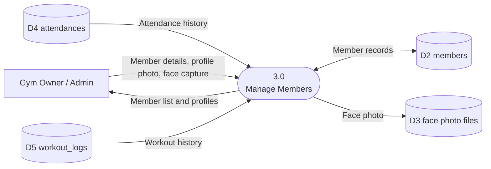
```mermaid
flowchart LR
    Admin["Gym Owner / Admin"]
    P3(["3.0<br/>Manage Members"])
    D2[("D2 members")]
    D3[("D3 face photo files")]
    D4[("D4 attendances")]
    D5[("D5 workout_logs")]

    Admin -->|"Member details, profile photo, face capture"| P3
    P3 -->|"Member list and profiles"| Admin
    P3 <-->|"Member records"| D2
    P3 -->|"Face photo"| D3
    D4 -->|"Attendance history"| P3
    D5 -->|"Workout history"| P3
```

### 3.4 Process 4.0 — Recognize Faces and Log Attendance

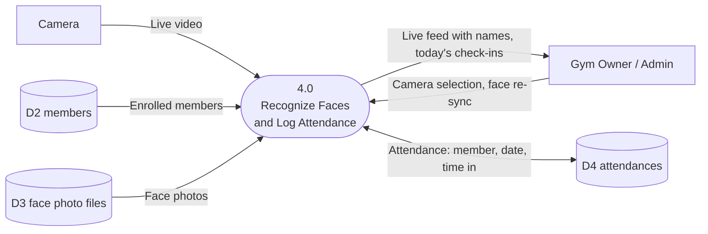
```mermaid
flowchart LR
    Camera["Camera"]
    Admin["Gym Owner / Admin"]
    P4(["4.0<br/>Recognize Faces<br/>and Log Attendance"])
    D2[("D2 members")]
    D3[("D3 face photo files")]
    D4[("D4 attendances")]

    Admin -->|"Camera selection, face re-sync"| P4
    P4 -->|"Live feed with names, today's check-ins"| Admin
    Camera -->|"Live video"| P4
    D2 -->|"Enrolled members"| P4
    D3 -->|"Face photos"| P4
    P4 <-->|"Attendance: member, date, time in"| D4
```

### 3.5 Process 5.0 — Monitor Workout Program

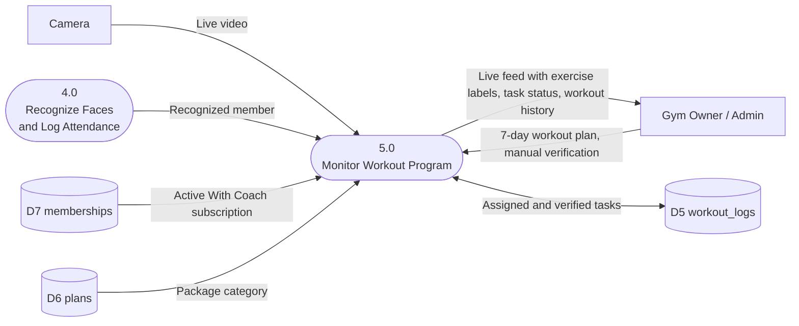
```mermaid
flowchart LR
    Camera["Camera"]
    Admin["Gym Owner / Admin"]
    P4(["4.0<br/>Recognize Faces<br/>and Log Attendance"])
    P5(["5.0<br/>Monitor Workout Program"])
    D5[("D5 workout_logs")]
    D6[("D6 plans")]
    D7[("D7 memberships")]

    Admin -->|"7-day workout plan, manual verification"| P5
    P5 -->|"Live feed with exercise labels, task status, workout history"| Admin
    Camera -->|"Live video"| P5
    P4 -->|"Recognized member"| P5
    P5 <-->|"Assigned and verified tasks"| D5
    D7 -->|"Active With Coach subscription"| P5
    D6 -->|"Package category"| P5
```

### 3.6 Process 6.0 — Manage Packages and Subscriptions

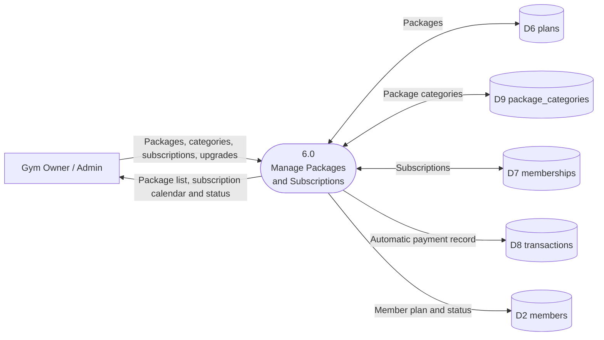
```mermaid
flowchart LR
    Admin["Gym Owner / Admin"]
    P6(["6.0<br/>Manage Packages<br/>and Subscriptions"])
    D2[("D2 members")]
    D6[("D6 plans")]
    D7[("D7 memberships")]
    D8[("D8 transactions")]
    D9[("D9 package_categories")]

    Admin -->|"Packages, categories, subscriptions, upgrades"| P6
    P6 -->|"Package list, subscription calendar and status"| Admin
    P6 <-->|"Packages"| D6
    P6 <-->|"Package categories"| D9
    P6 <-->|"Subscriptions"| D7
    P6 -->|"Automatic payment record"| D8
    P6 -->|"Member plan and status"| D2
```

### 3.7 Process 7.0 — Record Payments

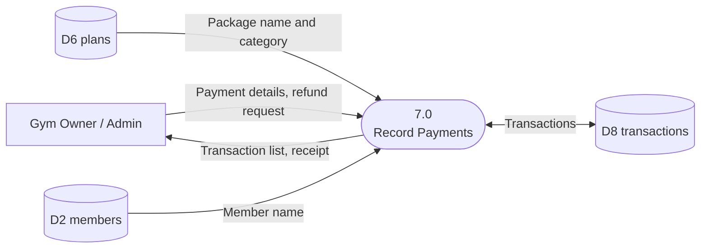
```mermaid
flowchart LR
    Admin["Gym Owner / Admin"]
    P7(["7.0<br/>Record Payments"])
    D2[("D2 members")]
    D6[("D6 plans")]
    D8[("D8 transactions")]

    Admin -->|"Payment details, refund request"| P7
    P7 -->|"Transaction list, receipt"| Admin
    P7 <-->|"Transactions"| D8
    D6 -->|"Package name and category"| P7
    D2 -->|"Member name"| P7
```

### 3.8 Process 8.0 — Generate Reports

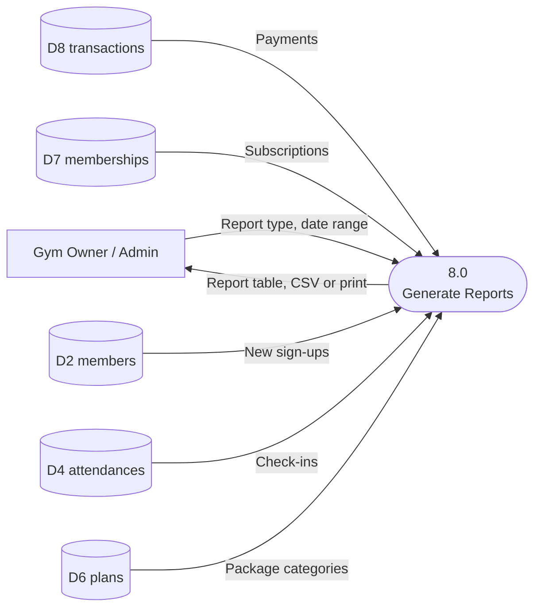
```mermaid
flowchart LR
    Admin["Gym Owner / Admin"]
    P8(["8.0<br/>Generate Reports"])
    D2[("D2 members")]
    D4[("D4 attendances")]
    D6[("D6 plans")]
    D7[("D7 memberships")]
    D8[("D8 transactions")]

    Admin -->|"Report type, date range"| P8
    P8 -->|"Report table, CSV or print"| Admin
    D8 -->|"Payments"| P8
    D7 -->|"Subscriptions"| P8
    D2 -->|"New sign-ups"| P8
    D4 -->|"Check-ins"| P8
    D6 -->|"Package categories"| P8
```

### 3.9 Process 9.0 — Manage Coach Events

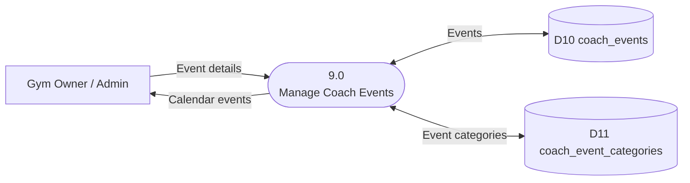
```mermaid
flowchart LR
    Admin["Gym Owner / Admin"]
    P9(["9.0<br/>Manage Coach Events"])
    D10[("D10 coach_events")]
    D11[("D11 coach_event_categories")]

    Admin -->|"Event details"| P9
    P9 -->|"Calendar events"| Admin
    P9 <-->|"Events"| D10
    P9 <-->|"Event categories"| D11
```

### 3.10 Process 10.0 — Manage Admin Profile

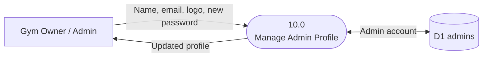
```mermaid
flowchart LR
    Admin["Gym Owner / Admin"]
    P10(["10.0<br/>Manage Admin Profile"])
    D1[("D1 admins")]

    Admin -->|"Name, email, logo, new password"| P10
    P10 -->|"Updated profile"| Admin
    P10 <-->|"Admin account"| D1
```

---

## 4. Use Case Diagram

### 4.1 Gym Owner / Admin

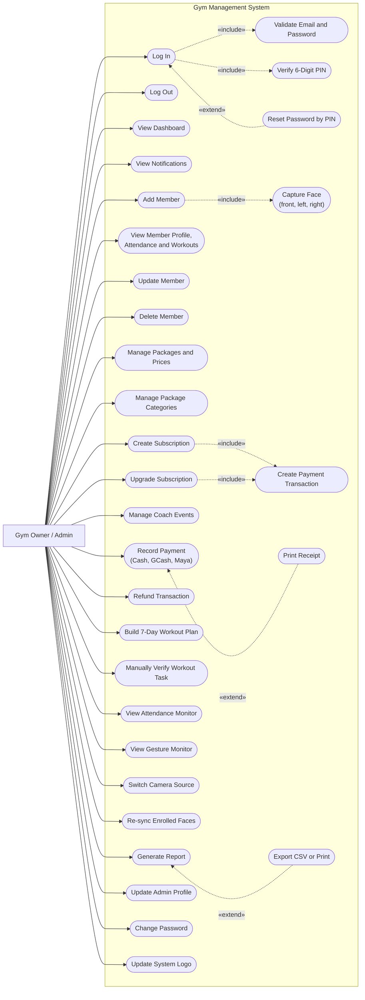
```mermaid
flowchart LR
    Admin["Gym Owner / Admin"]

    subgraph Boundary ["Gym Management System"]
        Login(["Log In"])
        ValCred(["Validate Email and Password"])
        VerPin(["Verify 6-Digit PIN"])
        Reset(["Reset Password by PIN"])
        Logout(["Log Out"])

        Dash(["View Dashboard"])
        Notif(["View Notifications"])

        AddMem(["Add Member"])
        Face(["Capture Face<br/>(front, left, right)"])
        ViewMem(["View Member Profile,<br/>Attendance and Workouts"])
        UpdMem(["Update Member"])
        DelMem(["Delete Member"])

        Pack(["Manage Packages and Prices"])
        Cat(["Manage Package Categories"])
        NewSub(["Create Subscription"])
        UpSub(["Upgrade Subscription"])
        AutoPay(["Create Payment Transaction"])
        Events(["Manage Coach Events"])

        Pay(["Record Payment<br/>(Cash, GCash, Maya)"])
        Receipt(["Print Receipt"])
        Refund(["Refund Transaction"])

        Plan(["Build 7-Day Workout Plan"])
        Manual(["Manually Verify Workout Task"])

        AttMon(["View Attendance Monitor"])
        GesMon(["View Gesture Monitor"])
        Switch(["Switch Camera Source"])
        Sync(["Re-sync Enrolled Faces"])

        Report(["Generate Report"])
        Export(["Export CSV or Print"])

        Profile(["Update Admin Profile"])
        Pass(["Change Password"])
        Logo(["Update System Logo"])

        Login -.->|"«include»"| ValCred
        Login -.->|"«include»"| VerPin
        Login ~~~ Reset
        Reset -.->|"«extend»"| Login
        AddMem -.->|"«include»"| Face
        NewSub -.->|"«include»"| AutoPay
        UpSub -.->|"«include»"| AutoPay
        Pay ~~~ Receipt
        Receipt -.->|"«extend»"| Pay
        Report ~~~ Export
        Export -.->|"«extend»"| Report
    end

    Admin --> Login
    Admin --> Logout
    Admin --> Dash
    Admin --> Notif
    Admin --> AddMem
    Admin --> ViewMem
    Admin --> UpdMem
    Admin --> DelMem
    Admin --> Pack
    Admin --> Cat
    Admin --> NewSub
    Admin --> UpSub
    Admin --> Events
    Admin --> Pay
    Admin --> Refund
    Admin --> Plan
    Admin --> Manual
    Admin --> AttMon
    Admin --> GesMon
    Admin --> Switch
    Admin --> Sync
    Admin --> Report
    Admin --> Profile
    Admin --> Pass
    Admin --> Logo
```

### 4.2 Camera / Gesture Engine

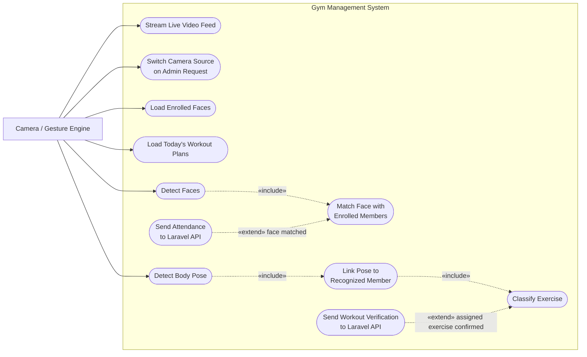
```mermaid
flowchart LR
    Camera["Camera / Gesture Engine"]

    subgraph Boundary ["Gym Management System"]
        Stream(["Stream Live Video Feed"])
        SwitchSrc(["Switch Camera Source<br/>on Admin Request"])
        LoadFaces(["Load Enrolled Faces"])
        LoadPlans(["Load Today's Workout Plans"])

        Detect(["Detect Faces"])
        Match(["Match Face with<br/>Enrolled Members"])
        Att(["Send Attendance<br/>to Laravel API"])

        Pose(["Detect Body Pose"])
        Link(["Link Pose to<br/>Recognized Member"])
        Classify(["Classify Exercise"])
        Verify(["Send Workout Verification<br/>to Laravel API"])

        Detect -.->|"«include»"| Match
        Att -.->|"«extend» face matched"| Match
        Pose -.->|"«include»"| Link
        Link -.->|"«include»"| Classify
        Verify -.->|"«extend» assigned exercise confirmed"| Classify
    end

    Camera --> Stream
    Camera --> SwitchSrc
    Camera --> LoadFaces
    Camera --> LoadPlans
    Camera --> Detect
    Camera --> Pose
```

### 4.3 Gym Member

```mermaid
flowchart LR
    Member["Gym Member"]

    subgraph Boundary ["Gym Management System"]
        Info(["Provide Personal Details<br/>to the Admin"])
        FacePose(["Pose for Face Capture<br/>(front, left, right)"])
        Pay(["Pay for a Package<br/>through the Admin"])

        Scan(["Face the Camera<br/>for Attendance"])
        Recog(["Be Recognized by Face"])
        Logged(["Attendance Logged"])

        Exercise(["Perform Assigned Exercise<br/>in Camera View"])
        ExRecog(["Exercise Recognized"])
        Verified(["Task Marked as Verified"])

        Scan -.->|"«include»"| Recog
        Logged -.->|"«extend» face matched"| Recog
        Exercise -.->|"«include»"| ExRecog
        Verified -.->|"«extend» assigned exercise confirmed"| ExRecog
    end

    Member --> Info
    Member --> FacePose
    Member --> Pay
    Member --> Scan
    Member --> Exercise
```

---

## 5. Logical Entity-Relationship Diagram

```mermaid
erDiagram
    ADMIN {
        text name
        text email
        text password
        text logo
    }
    LOGIN_PIN {
        text purpose
        text pin
        datetime expires_at
        number attempts
    }
    MEMBER {
        text first_name
        text last_name
        text email
        text phone
        text address
        date date_of_birth
        number height
        number weight
        text status
        text current_plan
        image profile_photo
        image face_photo
    }
    PACKAGE_CATEGORY {
        text name
        text color
    }
    PLAN {
        text name
        number price
        number duration_days
        text category
        text color
    }
    MEMBERSHIP {
        text plan_type
        date start_date
        date end_date
        text status
        text payment_method
        text notes
    }
    TRANSACTION {
        text transaction_id
        date transaction_date
        text type
        text description
        number amount
        text payment_method
        text reference_number
        text status
    }
    ATTENDANCE {
        date date
        time time_in
    }
    WORKOUT_LOG {
        text exercise
        date date
        number sets
        number reps
        text gesture_class
    }
    COACH_EVENT_CATEGORY {
        text name
        text color
    }
    COACH_EVENT {
        text title
        text description
        date start_date
        date end_date
        time start_time
        time end_time
        text location
    }

    ADMIN ||--o{ LOGIN_PIN : "verifies with"
    MEMBER ||--o{ MEMBERSHIP : "subscribes to"
    PLAN ||--o{ MEMBERSHIP : "is sold as"
    PACKAGE_CATEGORY |o--o{ PLAN : "groups"
    MEMBERSHIP ||--o{ TRANSACTION : "is paid by"
    MEMBER |o--o{ TRANSACTION : "pays"
    MEMBER ||--o{ ATTENDANCE : "checks in"
    MEMBER ||--o{ WORKOUT_LOG : "is assigned"
    COACH_EVENT_CATEGORY ||--o{ COACH_EVENT : "classifies"
```

---

## 6. Physical Entity-Relationship Diagram

```mermaid
erDiagram
    admins {
        bigint id PK
        varchar name
        varchar email UK
        varchar password
        varchar logo_path "nullable"
        timestamp created_at
        timestamp updated_at
    }
    auth_verification_codes {
        bigint id PK
        bigint admin_id FK
        varchar email
        varchar purpose
        varchar code_hash
        timestamp expires_at
        tinyint attempts
        timestamp created_at
        timestamp updated_at
    }
    password_reset_pins {
        bigint id PK
        varchar email
        varchar pin_hash
        tinyint attempts
        timestamp expires_at
        timestamp verified_at "nullable"
        timestamp created_at
        timestamp updated_at
    }
    personal_access_tokens {
        bigint id PK
        varchar tokenable_type
        bigint tokenable_id
        text name
        varchar token UK
        text abilities "nullable"
        timestamp last_used_at "nullable"
        timestamp expires_at "nullable"
        timestamp created_at
        timestamp updated_at
    }
    members {
        bigint id PK
        varchar first_name
        varchar last_name
        varchar email UK
        varchar phone
        varchar plan
        varchar status
        longtext enrolled_face_id "nullable, face photo path"
        varchar profile_pic "nullable"
        date dob "nullable"
        decimal height "nullable"
        decimal weight "nullable"
        text address "nullable"
        timestamp created_at
        timestamp updated_at
    }
    package_categories {
        bigint id PK
        varchar name UK
        varchar color
        timestamp created_at
        timestamp updated_at
    }
    plans {
        bigint id PK
        varchar name
        decimal price
        int duration_days
        varchar category
        varchar category_detail "nullable"
        varchar color "nullable"
        timestamp created_at
        timestamp updated_at
    }
    memberships {
        bigint id PK
        bigint member_id FK "nullable"
        varchar member_name_snapshot "nullable"
        varchar member_email_snapshot "nullable"
        varchar member_profile_pic_snapshot "nullable"
        bigint plan_id FK "nullable"
        varchar plan_type
        date start_date
        date end_date
        varchar status
        boolean auto_renew
        varchar payment_method
        varchar color
        text notes "nullable"
        timestamp created_at
        timestamp updated_at
    }
    transactions {
        bigint id PK
        varchar transaction_id UK
        date transaction_date
        bigint member_id FK "nullable"
        varchar member_name_snapshot "nullable"
        varchar member_email_snapshot "nullable"
        varchar member_profile_pic_snapshot "nullable"
        bigint membership_id FK "nullable"
        varchar type
        varchar description "nullable"
        varchar payment_method
        decimal amount
        varchar status
        varchar reference_number "nullable"
        varchar package_name_snapshot "nullable"
        varchar package_category_snapshot "nullable"
        timestamp created_at
        timestamp updated_at
    }
    attendances {
        bigint id PK
        bigint member_id FK
        date date
        time time_in
        timestamp created_at
        timestamp updated_at
    }
    workout_logs {
        bigint id PK
        bigint member_id FK
        varchar exercise
        date date
        smallint sets "nullable"
        smallint reps "nullable"
        varchar gesture_class "nullable"
        timestamp created_at
        timestamp updated_at
    }
    coach_event_categories {
        bigint id PK
        varchar name UK
        varchar color
        timestamp created_at
        timestamp updated_at
    }
    coach_events {
        bigint id PK
        bigint category_id FK
        varchar title
        text description "nullable"
        date start_date
        date end_date
        time start_time
        time end_time
        varchar location
        timestamp created_at
        timestamp updated_at
    }

    admins ||--o{ auth_verification_codes : "admin_id"
    admins ||..o{ personal_access_tokens : "tokenable_id (no FK)"
    admins ||..o{ password_reset_pins : "email (no FK)"
    members |o--o{ memberships : "member_id"
    plans |o--o{ memberships : "plan_id"
    package_categories |o..o{ plans : "category_detail = name (no FK)"
    members |o--o{ transactions : "member_id"
    memberships |o--o{ transactions : "membership_id"
    members ||--o{ attendances : "member_id"
    members ||--o{ workout_logs : "member_id"
    coach_event_categories ||--o{ coach_events : "category_id"
```

Decimal sizes: `members.height` and `members.weight` are DECIMAL(5,2), `plans.price` is DECIMAL(9,2), `transactions.amount` is DECIMAL(10,2).

On delete: `attendances`, `workout_logs` and `auth_verification_codes` cascade; `memberships.member_id`, `transactions.member_id` and `transactions.membership_id` are set to null; `coach_events.category_id` is restricted.

Confirm on your database before finalizing: whether `memberships.plan_id` has a real foreign key (`SHOW CREATE TABLE memberships;`). It is drawn here as one.

Not drawn because the application does not use them: `face_encodings`, `payments`, `exercise_sessions`, `gesture_logs`, `exercises`, `users`, and Laravel's own tables (`sessions`, `cache`, `jobs` and similar).
