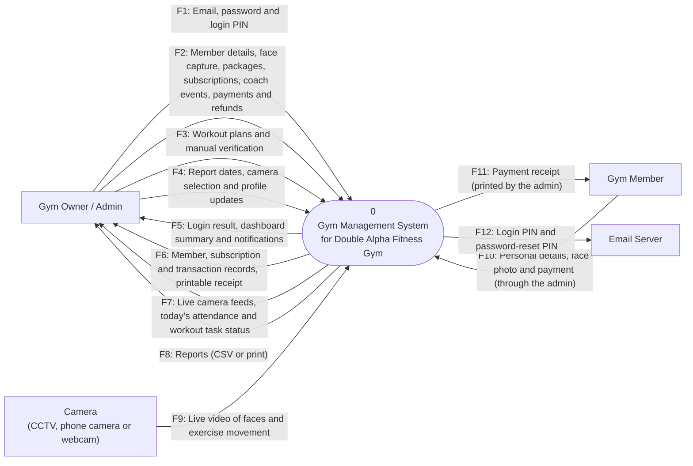

# 2. Context Level Diagram

[Back to the list of diagrams](../Correct_Diagrams.md)

```mermaid
flowchart LR
    Admin["Gym Owner / Admin"]
    Camera["Camera<br/>(CCTV, phone camera or webcam)"]
    Member["Gym Member"]
    Mail["Email Server"]
    System(["0<br/>Gym Management System<br/>for Double Alpha Fitness Gym"])

    Admin -->|"F1: Email, password and login PIN"| System
    Admin -->|"F2: Member details, face capture, packages, subscriptions, coach events, payments and refunds"| System
    Admin -->|"F3: Workout plans and manual verification"| System
    Admin -->|"F4: Report dates, camera selection and profile updates"| System

    System -->|"F5: Login result, dashboard summary and notifications"| Admin
    System -->|"F6: Member, subscription and transaction records, printable receipt"| Admin
    System -->|"F7: Live camera feeds, today's attendance and workout task status"| Admin
    System -->|"F8: Reports (CSV or print)"| Admin

    Camera -->|"F9: Live video of faces and exercise movement"| System
    Member -->|"F10: Personal details, face photo and payment (through the admin)"| System
    System -->|"F11: Payment receipt (printed by the admin)"| Member
    System -->|"F12: Login PIN and password-reset PIN"| Mail
```

Flow F12 applies when email is configured. In local mode the PIN is shown on the screen instead.
