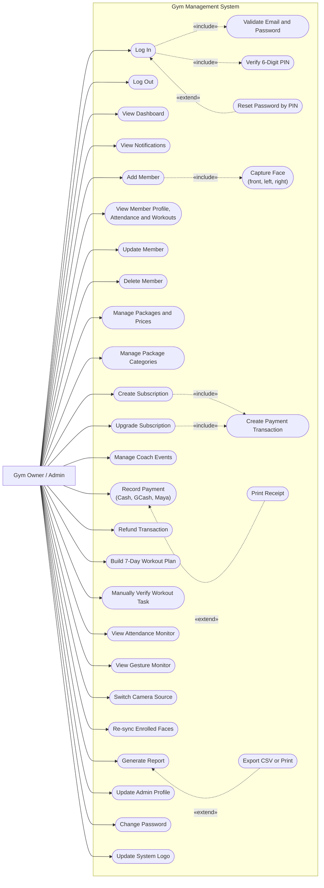
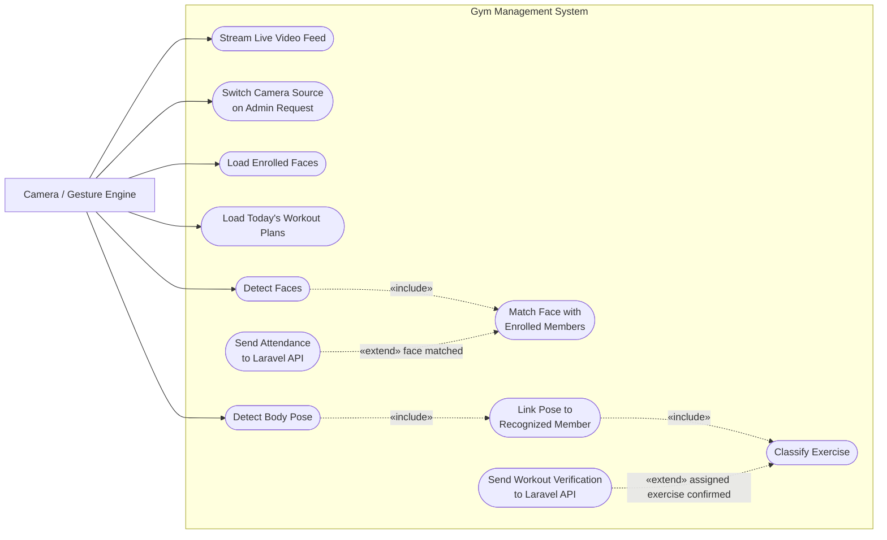
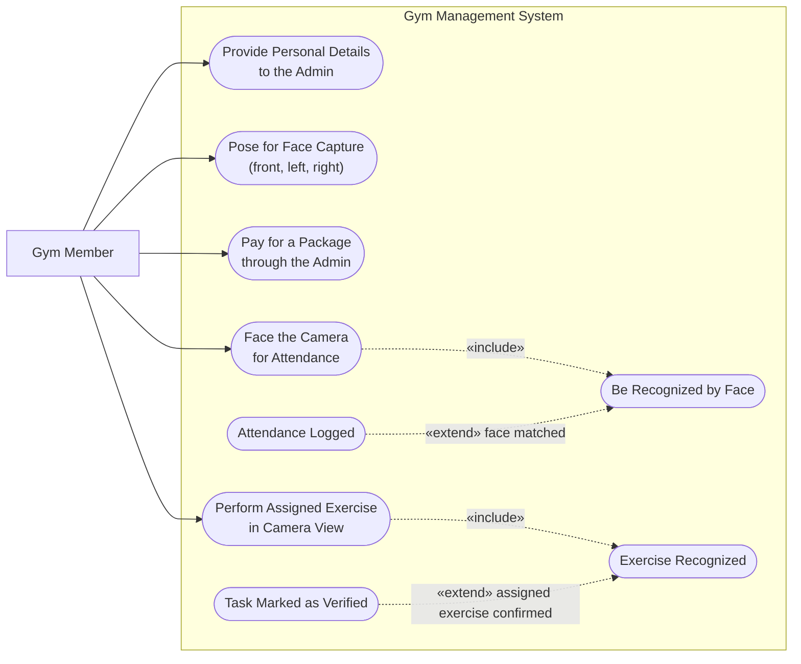

# 4. Use Case Diagram

[Back to the list of diagrams](../Correct_Diagrams.md)

## 4.1 Gym Owner / Admin

```mermaid
flowchart LR
    Admin["Gym Owner / Admin"]

    subgraph Boundary ["Gym Management System"]
        Login(["Log In"])
        ValCred(["Validate Email and Password"])
        VerPin(["Verify 6-Digit PIN"])
        Reset(["Reset Password by PIN"])
        Logout(["Log Out"])

        Dash(["View Dashboard"])
        Notif(["View Notifications"])

        AddMem(["Add Member"])
        Face(["Capture Face<br/>(front, left, right)"])
        ViewMem(["View Member Profile,<br/>Attendance and Workouts"])
        UpdMem(["Update Member"])
        DelMem(["Delete Member"])

        Pack(["Manage Packages and Prices"])
        Cat(["Manage Package Categories"])
        NewSub(["Create Subscription"])
        UpSub(["Upgrade Subscription"])
        AutoPay(["Create Payment Transaction"])
        Events(["Manage Coach Events"])

        Pay(["Record Payment<br/>(Cash, GCash, Maya)"])
        Receipt(["Print Receipt"])
        Refund(["Refund Transaction"])

        Plan(["Build 7-Day Workout Plan"])
        Manual(["Manually Verify Workout Task"])

        AttMon(["View Attendance Monitor"])
        GesMon(["View Gesture Monitor"])
        Switch(["Switch Camera Source"])
        Sync(["Re-sync Enrolled Faces"])

        Report(["Generate Report"])
        Export(["Export CSV or Print"])

        Profile(["Update Admin Profile"])
        Pass(["Change Password"])
        Logo(["Update System Logo"])

        Login -.->|"«include»"| ValCred
        Login -.->|"«include»"| VerPin
        Login ~~~ Reset
        Reset -.->|"«extend»"| Login
        AddMem -.->|"«include»"| Face
        NewSub -.->|"«include»"| AutoPay
        UpSub -.->|"«include»"| AutoPay
        Pay ~~~ Receipt
        Receipt -.->|"«extend»"| Pay
        Report ~~~ Export
        Export -.->|"«extend»"| Report
    end

    Admin --> Login
    Admin --> Logout
    Admin --> Dash
    Admin --> Notif
    Admin --> AddMem
    Admin --> ViewMem
    Admin --> UpdMem
    Admin --> DelMem
    Admin --> Pack
    Admin --> Cat
    Admin --> NewSub
    Admin --> UpSub
    Admin --> Events
    Admin --> Pay
    Admin --> Refund
    Admin --> Plan
    Admin --> Manual
    Admin --> AttMon
    Admin --> GesMon
    Admin --> Switch
    Admin --> Sync
    Admin --> Report
    Admin --> Profile
    Admin --> Pass
    Admin --> Logo
```

## 4.2 Camera / Gesture Engine

```mermaid
flowchart LR
    Camera["Camera / Gesture Engine"]

    subgraph Boundary ["Gym Management System"]
        Stream(["Stream Live Video Feed"])
        SwitchSrc(["Switch Camera Source<br/>on Admin Request"])
        LoadFaces(["Load Enrolled Faces"])
        LoadPlans(["Load Today's Workout Plans"])

        Detect(["Detect Faces"])
        Match(["Match Face with<br/>Enrolled Members"])
        Att(["Send Attendance<br/>to Laravel API"])

        Pose(["Detect Body Pose"])
        Link(["Link Pose to<br/>Recognized Member"])
        Classify(["Classify Exercise"])
        Verify(["Send Workout Verification<br/>to Laravel API"])

        Detect -.->|"«include»"| Match
        Att -.->|"«extend» face matched"| Match
        Pose -.->|"«include»"| Link
        Link -.->|"«include»"| Classify
        Verify -.->|"«extend» assigned exercise confirmed"| Classify
    end

    Camera --> Stream
    Camera --> SwitchSrc
    Camera --> LoadFaces
    Camera --> LoadPlans
    Camera --> Detect
    Camera --> Pose
```

## 4.3 Gym Member

```mermaid
flowchart LR
    Member["Gym Member"]

    subgraph Boundary ["Gym Management System"]
        Info(["Provide Personal Details<br/>to the Admin"])
        FacePose(["Pose for Face Capture<br/>(front, left, right)"])
        Pay(["Pay for a Package<br/>through the Admin"])

        Scan(["Face the Camera<br/>for Attendance"])
        Recog(["Be Recognized by Face"])
        Logged(["Attendance Logged"])

        Exercise(["Perform Assigned Exercise<br/>in Camera View"])
        ExRecog(["Exercise Recognized"])
        Verified(["Task Marked as Verified"])

        Scan -.->|"«include»"| Recog
        Logged -.->|"«extend» face matched"| Recog
        Exercise -.->|"«include»"| ExRecog
        Verified -.->|"«extend» assigned exercise confirmed"| ExRecog
    end

    Member --> Info
    Member --> FacePose
    Member --> Pay
    Member --> Scan
    Member --> Exercise
```
