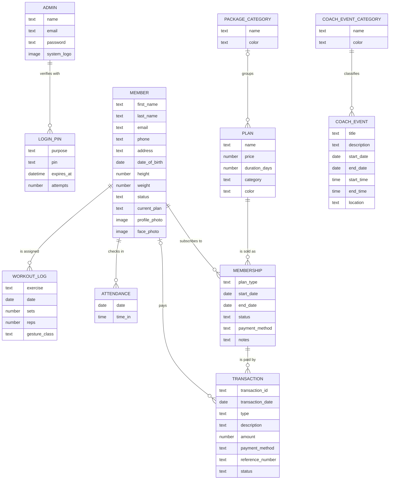

# 5. Logical Entity-Relationship Diagram

[Back to the list of diagrams](../Correct_Diagrams.md)

```mermaid
erDiagram
    ADMIN {
        text name
        text email
        text password
        image system_logo
    }
    LOGIN_PIN {
        text purpose
        text pin
        datetime expires_at
        number attempts
    }
    MEMBER {
        text first_name
        text last_name
        text email
        text phone
        text address
        date date_of_birth
        number height
        number weight
        text status
        text current_plan
        image profile_photo
        image face_photo
    }
    PACKAGE_CATEGORY {
        text name
        text color
    }
    PLAN {
        text name
        number price
        number duration_days
        text category
        text color
    }
    MEMBERSHIP {
        text plan_type
        date start_date
        date end_date
        text status
        text payment_method
        text notes
    }
    TRANSACTION {
        text transaction_id
        date transaction_date
        text type
        text description
        number amount
        text payment_method
        text reference_number
        text status
    }
    ATTENDANCE {
        date date
        time time_in
    }
    WORKOUT_LOG {
        text exercise
        date date
        number sets
        number reps
        text gesture_class
    }
    COACH_EVENT_CATEGORY {
        text name
        text color
    }
    COACH_EVENT {
        text title
        text description
        date start_date
        date end_date
        time start_time
        time end_time
        text location
    }

    ADMIN ||--o{ LOGIN_PIN : "verifies with"
    MEMBER ||--o{ MEMBERSHIP : "subscribes to"
    PLAN ||--o{ MEMBERSHIP : "is sold as"
    PACKAGE_CATEGORY |o--o{ PLAN : "groups"
    MEMBERSHIP ||--o{ TRANSACTION : "is paid by"
    MEMBER |o--o{ TRANSACTION : "pays"
    MEMBER ||--o{ ATTENDANCE : "checks in"
    MEMBER ||--o{ WORKOUT_LOG : "is assigned"
    COACH_EVENT_CATEGORY ||--o{ COACH_EVENT : "classifies"
```
