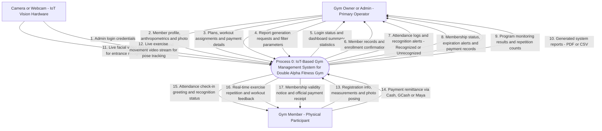

# 4.2-B Context Level Diagram

This section presents the **Context Level Diagram** (Data Flow Diagram Level 0) for the **IoT-Based Gym Management System with Facial Recognition Attendance and Gesture-Based Program Monitoring for Double Alpha Fitness Gym**.

---

## 1. Introduction (INTRODUCE)

A **Context Level Diagram** is the highest-level map of a software system. It places the entire application into a single central circle or box (labeled **Process 0**) and shows all outside actors or devices that communicate with it.

The purpose of this diagram is to define the boundaries of the system:
* **Who interacts with the system?** (The External Entities / Actors)
* **What information goes into the system?** (Inputs / Incoming Data Flows)
* **What information comes out of the system?** (Outputs / Outgoing Data Flows)

To keep the diagram visually clear and easy to read during presentations, related data items are grouped into concise, logical flows. This avoids overlapping lines while ensuring that every function—from registration and facial recognition to workout tracking and payments—is fully represented.

---

## 2. Context Level Diagram (PRESENT)

**Figure 4.2.** Simplified Context Level Diagram (DFD Level 0) for Double Alpha Fitness Gym.

---

## 3. Plain-English Explanation of Data Flows (EXPLAIN)

Below is an easy-to-understand breakdown of what each entity sends into the system and receives back:

### A. The Gym Owner / Admin (Primary User)
The Gym Owner or Coach operates the web application on a desktop, laptop, or tablet.

* **What the Owner / Admin sends IN:**
  1. **Admin login credentials:** Username and secure password to sign into the system.
  2. **Member profile, anthropometrics & facial photo command:** Inputs member contact information, measured height, weight, body type (Ectomorph, Mesomorph, Endomorph), and snaps their enrollment face photo.
  3. **Membership plan, workout assignment & payment details:** Configures membership pricing, assigns exercises from the approved scope, and records fees paid (Cash, GCash, or Maya).
  4. **Report generation requests & filter parameters:** Selects date ranges and categories to view or export business summaries.

* **What the Owner / Admin receives BACK:**
  5. **Login status & dashboard summary statistics:** Confirms login access and displays today's live gym stats (active members, attendance count, revenue).
  6. **Member records & biometric enrollment confirmation:** Displays saved member profiles and confirms face data is ready for recognition.
  7. **Real-time attendance logs & recognition alerts:** Alerts the admin immediately when a member checks in—or triggers an **"Unrecognized Member"** alert if a face cannot be matched.
  8. **Membership status, expiration alerts & payment records:** Shows active versus expired plans, highlights members expiring within 7 days, and lists recorded payments.
  9. **Program monitoring results & repetition counts:** Displays the verified repetition count and completed sets for assigned exercises.
  10. **Generated system reports:** Produces formatted PDF or CSV files for attendance, financial, and workout records.

---

### B. The Camera / Webcam (IoT Vision Hardware)
Smart cameras continuously capture video feeds at the gym entrance and exercise station without requiring manual button pressing.

* **What the Camera sends IN:**
  11. **Live facial video stream:** Streams optical frames of members entering the gym door for biometric facial recognition.
  12. **Live exercise movement video stream:** Streams optical frames of members performing exercises for skeletal joint detection and rep counting.

---

### C. The Gym Member (Physical Participant)
Members interact physically within the gym facility; they do not need to log into software or install an app.

* **What the Member provides IN:**
  13. **Registration info, measurements & facial photo posing:** Provides basic contact details, stands on the scale for height/weight measurements, and poses for the enrollment camera.
  14. **Payment remittance:** Hands over cash or shows GCash/Maya reference codes to the coach.

* **What the Member receives BACK:**
  15. **Attendance check-in greeting & recognition status:** An on-screen visual confirmation showing their name and welcoming them as they enter (or alerting them if unrecognized).
  16. **Real-time exercise repetition & workout feedback:** A large, clear on-screen counter showing their completed repetitions (1, 2, 3...) while they exercise.
  17. **Membership validity notice & official payment receipt:** Clear notification of plan expiration and a printed or digital receipt for membership dues.

---

## 4. Why This Diagram Matters for the Gym (INTERPRET)

By consolidating the data flows into clear, uncluttered channels, Figure 4.2 proves how **Process 0 eliminates the gym's manual bottlenecks**:
1. **Clear Visual Recognition:** Distinguishes enrolled members from unrecognized visitors instantly at the door without slowing down entry.
2. **Hands-Free Repetition Tracking:** Computer vision frees the coach from having to stand beside members counting reps by hand.
3. **No Software Burden on Members:** Members never have to remember passwords or navigate complicated mobile apps; their presence and movement drive the system.
4. **Clean and Audit-Ready Ledgers:** Consolidates loose paper notes and mobile payment screenshots into an organized database.

---

## 5. Connection to Study Objectives (CONNECT)

This Context Level Diagram directly supports the goals set in Chapter 1:
* It satisfies **Specific Objective (b)** by creating clean, verified system design models.
* It sets the foundation for **Section 4.2-C (Level 1 Data Flow Diagram)**, where Process 0 is expanded into its six core sub-processes:
  1. *Process 1.0:* Member Registration & Biometric Enrollment
  2. *Process 2.0:* Facial Recognition Attendance Monitoring
  3. *Process 3.0:* Gesture-Based Program Monitoring
  4. *Process 4.0:* Subscription Management
  5. *Process 5.0:* Payment Transaction Recording
  6. *Process 6.0:* System Reports & Analytics
