# 4.2-B Context Level Diagram

This section presents the **Context Level Diagram** (also called Data Flow Diagram Level 0) for the **IoT-Based Gym Management System with Facial Recognition Attendance and Gesture-Based Program Monitoring for Double Alpha Fitness Gym**.

---

## 1. Introduction (INTRODUCE)

A **Context Level Diagram** is the highest-level map of a computer system. It shows the entire system as a single process (labeled **Process 0**) sitting in the middle, and identifies all the outside people, devices, or entities that talk to it. 

The purpose of this diagram is to define the boundaries of the system:
* **Who interacts with the system?** (The External Entities / Actors)
* **What information goes into the system?** (Inputs / Incoming Data Flows)
* **What information comes out of the system?** (Outputs / Outgoing Data Flows)

For Double Alpha Fitness Gym, this diagram illustrates how the owner/coach, the gym members, and the smart cameras work together through one unified digital platform.

---

## 2. Context Level Diagram (PRESENT)

```mermaid
flowchart TD
    %% Styling
    classDef entityStyle fill:#1e293b,stroke:#3b82f6,stroke-width:2px,color:#ffffff,font-weight:bold;
    classDef systemStyle fill:#0f172a,stroke:#10b981,stroke-width:3px,color:#ffffff,font-weight:bold;

    %% External Entities
    Admin["🧑‍💼 GYM OWNER / ADMIN<br>(Primary System Operator)"]:::entityStyle
    Camera["📷 CAMERA / WEBCAM<br>(IoT Vision Hardware)"]:::entityStyle
    Member["🏃 GYM MEMBER<br>(Physical Participant)"]:::entityStyle

    %% Central Process 0
    System(["<b>PROCESS 0</b><br><br><b>AN IoT-BASED GYM MANAGEMENT SYSTEM WITH<br>FACIAL RECOGNITION ATTENDANCE AND GESTURE-BASED<br>PROGRAM MONITORING FOR DOUBLE ALPHA FITNESS GYM</b>"]):::systemStyle

    %% Admin Data Inflows (Inputs)
    Admin -->|1. Login credentials| System
    Admin -->|2. Member registration & anthropometric details| System
    Admin -->|3. Facial enrollment capture command| System
    Admin -->|4. Membership plan & renewal details| System
    Admin -->|5. Workout exercise assignment| System
    Admin -->|6. Payment transaction details Cash / GCash / Maya| System
    Admin -->|7. Report generation request & filters| System

    %% Admin Data Outflows (Outputs)
    System -->|8. Authentication status & dashboard statistics| Admin
    System -->|9. Member profiles & facial enrollment status| Admin
    System -->|10. Real-time attendance logs & unknown face alerts| Admin
    System -->|11. Membership status & expiration reminders| Admin
    System -->|12. Program monitoring results & repetition counts| Admin
    System -->|13. Payment transaction records & payment history| Admin
    System -->|14. Generated system reports PDF / CSV| Admin

    %% Camera Data Inflows (Inputs)
    Camera -->|15. Facial video stream / entrance camera frames| System
    Camera -->|16. Exercise movement video stream / workout frames| System

    %% Member Data Inflows (Inputs)
    Member -->|17. Personal, contact & measurement info| System
    Member -->|18. Facial photo presentation posing| System
    Member -->|19. Payment remittance Cash / GCash / Maya| System

    %% Member Data Outflows (Outputs)
    System -->|20. Attendance check-in confirmation & greeting| Member
    System -->|21. Membership validity status & renewal notice| Member
    System -->|22. Real-time exercise repetition feedback| Member
    System -->|23. Official payment receipt confirmation| Member
```

**Figure 4.2.** Context Level Diagram (DFD Level 0) for Double Alpha Fitness Gym.

---

## 3. Plain-English Explanation of Data Flows (EXPLAIN)

The diagram contains **three outside entities** and **one central system**. Below is a simple, non-technical explanation of what each entity gives to the system and what it receives back:

### A. The Gym Owner / Admin (The Main User)
The Gym Owner or Coach is the only person who logs into the computer or tablet to operate the software.

* **What the Owner / Admin sends INTO the system:**
  1. **Login credentials:** Enters their username and secure password to log in.
  2. **Member registration & anthropometric details:** Enters new member information including name, phone number, gender, measured height, weight, and body type (Ectomorph, Mesomorph, or Endomorph).
  3. **Facial enrollment capture command:** Clicks to snap the member's reference face photo for attendance.
  4. **Membership plan & renewal details:** Sets up pricing plans (e.g., Monthly Pass) and logs membership renewals.
  5. **Workout exercise assignment:** Selects which specific exercise the member should do for the day (from the approved list: squats, push-ups, curls, etc.).
  6. **Payment transaction details:** Records how much money was paid and how it was paid (Cash, GCash, or Maya).
  7. **Report generation request & filters:** Chooses a date range to generate gym summaries.

* **What the Owner / Admin receives BACK from the system:**
  8. **Authentication status & dashboard statistics:** Access to the system and an overview showing today's attendance count, active members, and income.
  9. **Member profiles & facial enrollment status:** Confirmation that the member's profile and face photo are saved.
  10. **Real-time attendance logs & unknown alerts:** Live notification showing who just walked into the gym, with their photo and timestamp, or a warning if an unrecognized face is seen.
  11. **Membership status & expiration reminders:** Alerts showing whose plan is active and who is about to expire in the next 7 days.
  12. **Program monitoring results & repetition counts:** Instant verification of how many exercise repetitions the member finished.
  13. **Payment transaction records & payment history:** Complete financial ledger showing all recorded cash and online payments.
  14. **Generated system reports:** Ready-to-print PDF reports or CSV spreadsheets for attendance, income, and workout history.

---

### B. The Camera / Webcam (The IoT Vision Hardware)
The camera acts as an automatic helper that watches the gym entrance and the workout area. It operates continuously without needing anyone to press buttons.

* **What the Camera sends INTO the system:**
  15. **Facial video stream / entrance frames:** Sends live video of people entering the door so the system can recognize their faces for attendance.
  16. **Exercise movement video stream / workout frames:** Sends live video of the member doing exercises so the system can track their body joints and count completed repetitions.

---

### C. The Gym Member (The Physical Participant)
Gym members do not need passwords, apps, or computers. They participate naturally inside the gym facility.

* **What the Member provides INTO the system:**
  17. **Personal, contact & measurement info:** Tells the coach their basic details and steps on the weighing scale.
  18. **Facial photo presentation:** Faces the camera during registration to have their baseline photo taken.
  19. **Payment remittance:** Hands over cash or shows proof of payment via GCash or Maya.

* **What the Member receives BACK from the system:**
  20. **Attendance check-in confirmation & greeting:** An on-screen visual confirmation showing their name and welcoming them when their face is recognized at the entrance.
  21. **Membership validity status & renewal notice:** Notice of whether their membership is active or needs renewal.
  22. **Real-time exercise repetition feedback:** An on-screen counter that counts their reps (1, 2, 3...) as they perform their workout.
  23. **Official payment receipt confirmation:** A clear, printed or digital receipt showing the payment date, amount, and plan expiration date.

---

## 4. Why This Diagram Matters for the Gym (INTERPRET)

In the previous manual setup, Double Alpha Fitness Gym operated with severe communication delays and paper clutter:
* Attendance was trapped on physical logbook pages.
* Payments were handwritten on paper slips or saved as unorganized phone screenshots.
* Workout reps had to be visually tracked by the coach while trying to manage other customers.

Figure 4.2 proves that **Process 0 replaces all disconnected paper records with a single, real-time digital brain**:
1. **Zero Burden on Members:** Members simply walk in, exercise, and pay. The technology works around them without forcing them to learn software.
2. **Effortless Coaching:** The coach does not have to spend hours counting reps or flipping through past logbooks; the system feeds clean summaries directly to their dashboard.
3. **Audit-Ready Financials:** Every peso (Cash, GCash, or Maya) entered immediately updates the member's subscription and records an unalterable transaction.

---

## 5. Connection to Study Objectives (CONNECT)

This Context Level Diagram directly supports the goals set in Chapter 1:
* It fulfills **Specific Objective (b)** by producing standard system architecture and design diagrams.
* It lays the exact foundation for **Section 4.2-C (Data Flow Diagram Level 1)**, where this single Process 0 is broken down into its six detailed sub-modules:
  1. *Module 1.0:* Member Registration & Biometric Enrollment
  2. *Module 2.0:* Facial Recognition Attendance Monitoring
  3. *Module 3.0:* Gesture-Based Program Monitoring
  4. *Module 4.0:* Subscription & Plan Management
  5. *Module 5.0:* Payment Transaction Recording
  6. *Module 6.0:* System Reports & Analytics
