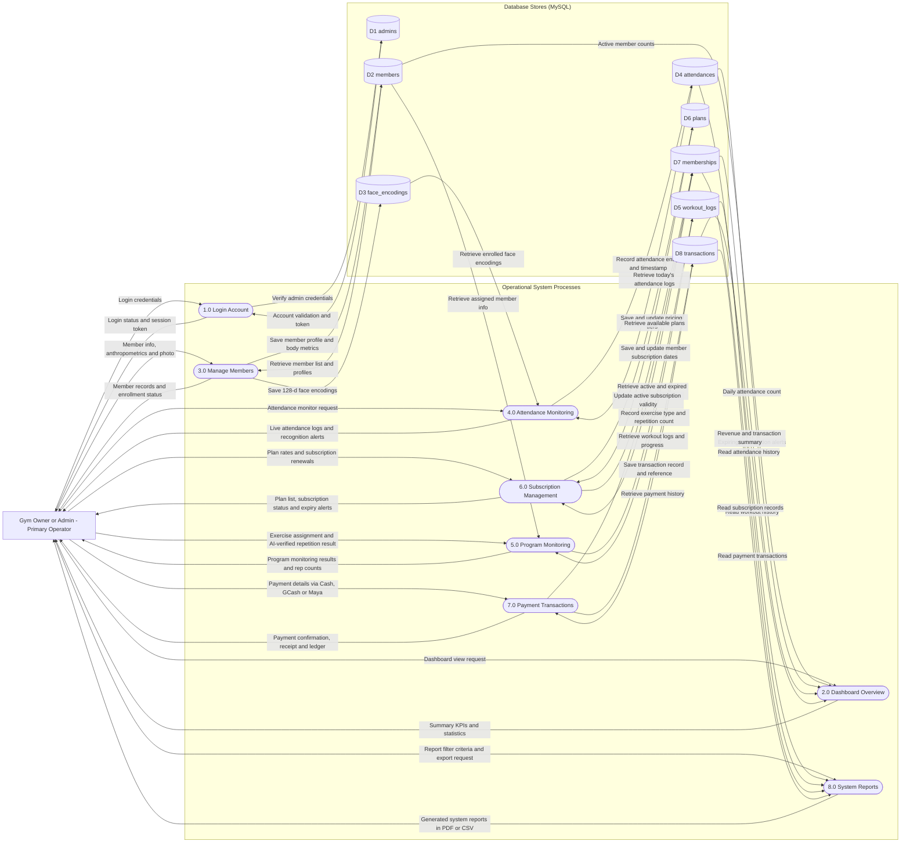

# 4.2-C Data Flow Diagram (DFD Level 1)

This section presents the **Data Flow Diagram (Level 1)** for the **IoT-Based Gym Management System with Facial Recognition Attendance and Gesture-Based Program Monitoring for Double Alpha Fitness Gym**. 

---

## 1. Introduction (INTRODUCE)

A **Data Flow Diagram (DFD) Level 1** decomposes the high-level Context Level Diagram (Process 0) into its primary sub-processes. It illustrates how data moves throughout the system by showing:
1. **External Entities:** The users or sources exchanging information with the system.
2. **Sub-Processes:** The specific functional activities that receive, process, and transform data.
3. **Data Stores (Tables):** The physical MySQL database tables where records are saved, read, and updated.
4. **Data Flows:** The directed paths indicating the exact data entering and exiting each process and data store.

Following the role-based DFD structure, Figure 4.3 illustrates the Level 1 Data Flow Diagram for the **Gym Owner / Administrator**, who serves as the primary system operator managing gym operations.

---

## 2. Data Flow Diagram for Gym Owner / Administrator (PRESENT)

**Figure 4.3.** Data Flow Diagram (DFD Level 1) for Gym Owner / Administrator.

---

## 3. Detailed Discussion of Data Flows (EXPLAIN)

The Level 1 Data Flow Diagram breaks down the system into **eight operational processes** and connects them to **eight physical MySQL data stores**. The step-by-step movement of data is detailed below:

### Process 1.0: Login Account
* **Description:** Handles administrator authentication and security session management.
* **Inflow from Admin:** The administrator inputs their username and password.
* **Data Store Interaction:** The process queries **`D1 admins`** to verify credentials against the stored bcrypt password hash.
* **Outflow to Admin:** The process issues a Laravel Sanctum session bearer token and redirects the administrator to the main dashboard.

---

### Process 2.0: Dashboard Overview
* **Description:** Gathers real-time operational metrics across all gym activities for fast managerial decision-making.
* **Inflow from Admin:** The administrator navigates to the dashboard view.
* **Data Store Interaction:** The process reads active member totals from **`D2 members`**, current daily entries from **`D4 attendances`**, and memberships expiring within the next 7 days from **`D7 memberships`**.
* **Outflow to Admin:** The dashboard presents visual KPI cards, quick summary counters, and real-time smart notification alerts.

---

### Process 3.0: Manage Members
* **Description:** Manages member profiles, anthropometric baseline measurements, and facial biometric enrollment.
* **Inflow from Admin:** The administrator enters personal details (name, contact, gender), anthropometric data (height, weight, and body type: Ectomorph, Mesomorph, Endomorph), and captures the member's front-facing face photo.
* **Data Store Interaction:** 
  - Writes member demographics and physical measurements into **`D2 members`**.
  - Extracts and writes 128-dimensional facial vectors into **`D3 face_encodings`**.
  - Reads saved records from **`D2 members`** when searching or viewing profiles.
* **Outflow to Admin:** Returns the updated member directory, profile views, and biometric enrollment status badges.

---

### Process 4.0: Attendance Monitoring
* **Description:** Controls the automated facial recognition check-in monitor and logs member arrival timestamps.
* **Inflow from Admin:** The administrator opens the Security Monitor page to observe check-ins.
* **Data Store Interaction:**
  - Reads facial reference encodings from **`D3 face_encodings`** for real-time camera matching.
  - Inserts verified entry timestamps, dates, and attendance statuses into **`D4 attendances`**.
  - Reads today's check-in logs from **`D4 attendances`**.
* **Outflow to Admin:** Displays real-time attendance entries with member photo, timestamp, and instant alerts for unrecognized visitors.

---

### Process 5.0: Program Monitoring
* **Description:** Handles workout exercise assignments and tracks repetition counts detected by the vision engine.
* **Inflow from Admin:** The administrator assigns a selected exercise (e.g., Squats, Push-ups, Curls) from the approved scope to a member, or performs manual workout log verification.
* **Data Store Interaction:**
  - Reads member information from **`D2 members`** to verify task eligibility.
  - Inserts completed exercise type, repetition counts, and timestamps into **`D5 workout_logs`**.
* **Outflow to Admin:** Returns real-time repetition updates, completed workout summaries, and historical progress notes.

---

### Process 6.0: Subscription Management
* **Description:** Manages membership pricing tiers, subscription durations, and expiration monitoring.
* **Inflow from Admin:** The administrator creates new membership plans or initiates subscription renewals.
* **Data Store Interaction:**
  - Reads and writes pricing plans and duration days in **`D6 plans`**.
  - Reads, writes, and updates member subscription start and expiry dates in **`D7 memberships`**.
* **Outflow to Admin:** Returns active subscription tables, plan options, and renewal alerts.

---

### Process 7.0: Payment Transactions
* **Description:** Records membership payments across multi-channel payment methods and activates subscriptions.
* **Inflow from Admin:** The administrator enters the payment amount, reference number, and payment method (Cash, GCash, or Maya).
* **Data Store Interaction:**
  - Inserts payment records and audit details into **`D8 transactions`**.
  - Updates the linked member's subscription validity in **`D7 memberships`** to activate their gym pass.
* **Outflow to Admin:** Returns a recorded transaction confirmation, updated ledger history, and a printable official PDF receipt.

---

### Process 8.0: System Reports
* **Description:** Aggregates and filters historical operational data to produce audit-ready management reports.
* **Inflow from Admin:** The administrator selects a report category (Attendance, Membership, Program Monitoring, or Payment) and sets date range filters.
* **Data Store Interaction:** Queries historical records across **`D4 attendances`**, **`D5 workout_logs`**, **`D7 memberships`**, and **`D8 transactions`**.
* **Outflow to Admin:** Delivers on-screen data summaries and downloadable, formatted reports in PDF and CSV formats.

---

## 4. Analytical Interpretation (INTERPRET)

Figure 4.3 demonstrates the architectural transition of Double Alpha Fitness Gym into an organized, database-backed information system:
1. **Centralized Data Persistence:** In contrast to manual logbooks where information was scattered across paper notebooks and mobile screenshots, every operational activity is systematically written to dedicated, indexed MySQL tables.
2. **Immediate Transactional Integrity:** When a payment is recorded in Process 7.0, it simultaneously updates **`D8 transactions`** and extends the subscription record in **`D7 memberships`**, ensuring that a member is never left active without a recorded payment.
3. **Decoupled Biometric Processing:** Facial encodings (**`D3`**) and workout logs (**`D5`**) are stored independently from primary member profiles (**`D2`**), optimizing query speeds and ensuring high-performance biometric lookups.

---

## 5. Connection to Study Objectives and Next Phases (CONNECT)

This Data Flow Diagram Level 1 operationalizes the conceptual framework established in Chapter 1:
* It satisfies **Specific Objective (b)** by detailing the data movement between system functions and physical storage.
* It directly bridges the gap between the functional requirements in **Section 4.1-C** and the database design presented in **Section 4.2-E (Logical ERD)** and **Section 4.2-F (Physical Database Schema)**.
