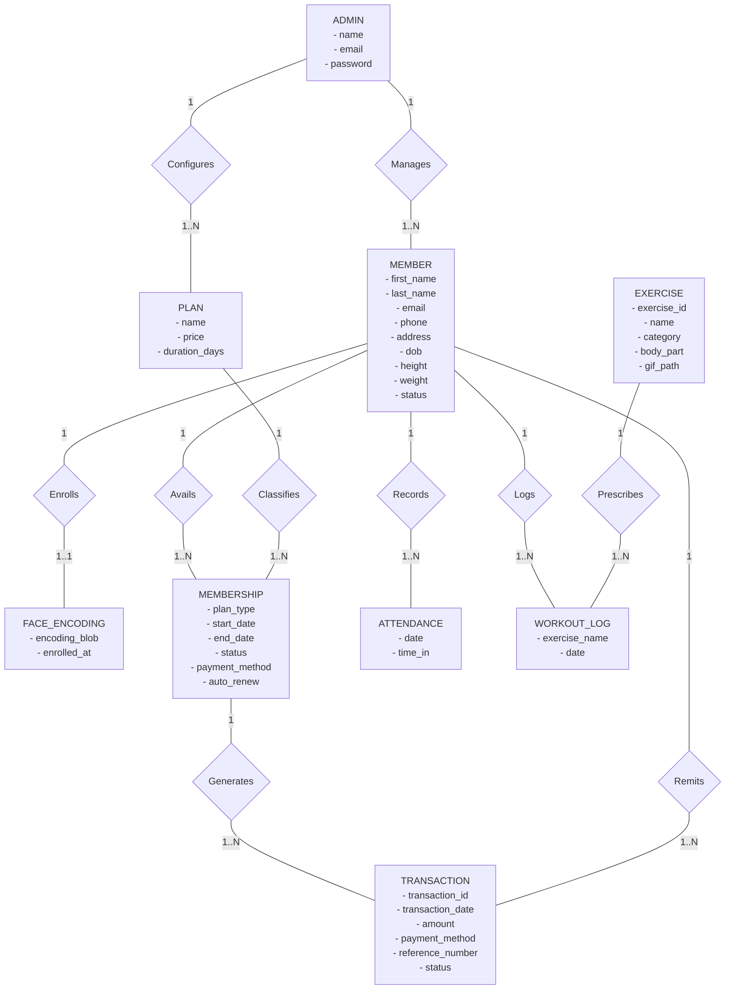

# 4.2-E Logical Entity-Relationship Diagram

This section presents the **Logical Entity-Relationship Diagram (ERD)** for the **IoT-Based Gym Management System with Facial Recognition Attendance and Gesture-Based Program Monitoring for Double Alpha Fitness Gym**.

---

## 1. Logical Entity-Relationship Diagram (PRESENT)

**Figure 4.4.** Logical Entity-Relationship Diagram for Double Alpha Fitness Gym.

---

## 2. Logical Entity and Relationship Matrix

The table below summarizes the logical business entities, their key attributes, and their relational cardinalities:

| Entity Name | Description | Key Business Attributes | Related Entities & Cardinality |
|---|---|---|---|
| **ADMIN** | System operator account managing gym operations. | `name`, `email`, `password` | **1 : N** with `MEMBER` (Manages) **1 : N** with `PLAN` (Configures) |
| **MEMBER** | Gym patron registered in the fitness center. | `first_name`, `last_name`, `email`, `phone`, `address`, `dob`, `height`, `weight`, `status` | **1 : 1** with `FACE_ENCODING` (Enrolls) **1 : N** with `MEMBERSHIP` (Avails) **1 : N** with `TRANSACTION` (Remits) **1 : N** with `ATTENDANCE` (Records) **1 : N** with `WORKOUT_LOG` (Logs) |
| **FACE_ENCODING** | 128-dimensional biometric facial embedding vectors. | `encoding_blob`, `enrolled_at` | **1 : 1** with `MEMBER` (Owned by) |
| **PLAN** | Gym pricing catalog defining plan duration and rates. | `name`, `price`, `duration_days` | **1 : N** with `MEMBERSHIP` (Classifies) |
| **MEMBERSHIP** | Subscription periods assigned to or renewed by a member. | `plan_type`, `start_date`, `end_date`, `status`, `payment_method`, `auto_renew` | **N : 1** with `MEMBER` **N : 1** with `PLAN` **1 : N** with `TRANSACTION` (Generates) |
| **TRANSACTION** | Financial transaction ledger for cash and e-wallet payments. | `transaction_id`, `transaction_date`, `amount`, `payment_method`, `reference_number`, `status` | **N : 1** with `MEMBER` **N : 1** with `MEMBERSHIP` (Bound to subscription period) |
| **ATTENDANCE** | Touchless facial recognition check-in logs. | `date`, `time_in` | **N : 1** with `MEMBER` |
| **WORKOUT_LOG** | AI gesture-detected and coach-verified workout entries. | `exercise_name`, `date` | **N : 1** with `MEMBER` **N : 1** with `EXERCISE` |
| **EXERCISE** | Pre-loaded workout library with GIF demonstration media. | `exercise_id`, `name`, `category`, `body_part`, `gif_path` | **1 : N** with `WORKOUT_LOG` (Prescribes) |

---

> [!NOTE]
> The complete narrative explanation complying with the **INTRODUCE $\rightarrow$ PRESENT $\rightarrow$ EXPLAIN $\rightarrow$ INTERPRET $\rightarrow$ CONNECT** format is located in the companion documentation file:  
> 📄 **[Logical Entity-Relationship Diagram docs.md](./Logical%20Entity-Relationship%20Diagram%20docs.md)**