# 4.1 Requirements Gathering and Analysis Phase

This section presents the results of the requirements gathering and analysis phase conducted at Double Alpha Fitness Gym in Natumolan, Tagoloan, Misamis Oriental. The findings were obtained through structured interviews with the gym owner, direct observation of daily gym activities, and the review of existing paper records, including membership forms, logbooks, and payment receipts.

---

## 4.1-A Process Definition

Prior to the conceptualization and development of the proposed Camera-Based Gym Management System, Double Alpha Fitness Gym relied entirely on manual, paper-based, and observational procedures. The overall manual workflow is structured into four sequential operational stages: Member Registration & Payment, Attendance & Membership Verification, Fitness Program Monitoring, and Record Maintenance & Reporting.

Figure 4.1 presents the manual process flow diagram representing the existing operations performed by the Gym Owner / Administrator and Gym Members.

```mermaid
flowchart TD
    %% Stage 1: Member Registration & Payment
    subgraph S1 ["Stage 1: Member Registration & Payment"]
        Start([Start]) --> M_FillForm["Member fills out membership form\n(in person / paper)"]
        M_FillForm --> M_SubmitInfo["Submit personal, contact, and\nanthropometric information"]
        M_SubmitInfo --> Admin_Review["Gym owner / admin receives\nand reviews information"]
        Admin_Review --> InfoComplete{"Is the\ninformation\ncomplete?"}
        
        InfoComplete -- "No" --> ReturnMember["Return to member for correction"]
        ReturnMember --> M_SubmitInfo
        
        InfoComplete -- "Yes" --> Admin_RecordMan["Admin records member information manually\n(logbook / spreadsheet)"]
        Admin_RecordMan --> Admin_RecordPay["Admin records membership and payment details\n(Cash / GCash / Maya)"]
        Admin_RecordPay --> ConfirmMem["Confirm membership to the member"]
    end

    %% Stage 2: Attendance & Membership Verification
    subgraph S2 ["Stage 2: Attendance & Membership Verification"]
        ConfirmMem --> VisitGym["Member visits the gym\n(checks in)"]
        VisitGym --> CheckActive{"Is the\nmembership\nactive?"}
        
        CheckActive -- "No" --> RenewMem["Member renews membership"]
        RenewMem --> ProcessRenewal["Admin processes renewal\nand updates membership status"]
        ProcessRenewal --> RecordAtt["Admin records attendance in the logbook"]
        
        CheckActive -- "Yes" --> RecordAtt
        RecordAtt --> ProceedGym["Member proceeds with gym activities"]
    end

    %% Stage 3: Fitness Program Monitoring
    subgraph S3 ["Stage 3: Fitness Program Monitoring"]
        ProceedGym --> AssessMem["Admin assesses member body type\n(Ectomorph / Mesomorph / Endomorph)"]
        AssessMem --> AssignProg["Admin assigns fitness program to member\n(new member or new program)"]
        AssignProg --> ExplainEx["Admin explains exercises and proper techniques"]
        ExplainEx --> ObserveMem["Admin manually observes and monitors the member"]
        ObserveMem --> RecordProg["Admin records progress manually\n(paper progress notes / logbook)"]
    end

    %% Stage 4: Record Maintenance & Reporting
    subgraph S4 ["Stage 4: Record Maintenance & Reporting"]
        RecordProg --> MaintainRec["Admin maintains attendance, membership,\npayment, and member records"]
        MaintainRec --> PrepareRep["Admin prepares reports\n(attendance, payments, member list,\nand other available records)"]
        PrepareRep --> FileRec["Admin files and stores records\n(physical filing / logbooks)"]
        FileRec --> EndNode([End])
    end
```

**Figure 4.1.** Manual Process Flow for Admin at Double Alpha Fitness Gym.

---

### Step-by-Step Narrative Explanation (EXPLAIN)

The manual workflow depicted in Figure 4.1 illustrates the chronological sequence of tasks required to operate the gym manually:

1. **Stage 1: Member Registration & Payment:**
   A prospective member physically visits the facility and fills out a blank paper membership form. The applicant enters their personal information (full name, gender, contact number, emergency contact) and anthropometric details (measured height and weight). The gym owner or administrator receives and reviews the physical form. A decision point occurs: *Is the information complete?* If required items are missing or illegible, the form is handed back to the member for correction. If the information is complete, the administrator writes the member's profile into an intake logbook or an offline spreadsheet file, collects and records the initial membership fee (paid via Cash, GCash, or Maya), and verbally confirms membership activation.

2. **Stage 2: Attendance & Membership Verification:**
   Upon arrival at the gym for a workout session, the member approaches the front desk counter. The administrator manually writes the member's name, arrival time, and current date into the daily attendance logbook. The administrator then verifies the member's subscription status by checking paper index cards or searching a local spreadsheet: *Is the membership active?* If the membership is active, the member is cleared to enter the workout area. If the membership has expired, the administrator halts check-in, calculates renewal dues, collects payment, and manually updates the expiration record before the member proceeds.

3. **Stage 3: Fitness Program Monitoring:**
   For members participating in structured workout routines, the administrator (who simultaneously functions as the fitness coach) assigns a workout regimen based on the member's initial physical assessment. The administrator demonstrates the exercises and proper lifting techniques. While the member performs the assigned exercises, the administrator visually watches the member to verify execution and count completed repetitions. At the conclusion of the session, the administrator writes the completed sets, repetitions, and performance notes into a paper workout tracking notebook.

4. **Stage 4: Record Maintenance & Reporting:**
   At periodic intervals (daily closing, weekly reviews, and monthly reconciliations), the administrator manually compiles the records. This requires cross-referencing entries across multiple attendance notebooks, membership forms, and digital payment transaction screenshots (GCash and Maya). Summary reports are drafted manually on paper or typed into standalone spreadsheets. Finally, the physical forms and logbooks are filed into storage folders and filing cabinets.

---

### Operational Problems Observed (INTERPRET)

Observation of the manual process revealed several operational challenges:
* **Front-Desk Queues and Inaccurate Attendance:** During peak hours (typically 5:00 PM to 8:00 PM), arriving members crowd around the front desk to sign the logbook. This creates long waiting times and leads to illegible signatures, missed timestamps, and unrecorded entries.
* **Delayed Expiration Tracking:** Because expiration dates must be manually verified against paper logs, expired memberships frequently go unnoticed, resulting in uncollected fees and delayed renewals.
* **Coaching Distraction and Incomplete Workout Tracking:** A single coach cannot accurately watch and count repetitions for several members training at the same time. Consequently, exercise progress records are often approximated, incomplete, or omitted entirely.
* **Misplaced Records and Financial Discrepancies:** Paper logbooks and loose handwritten receipts are susceptible to physical wear, misplacement, and math errors during manual monthly income calculations.

---

### Implications for the Proposed System (CONNECT)

These documented operational deficiencies directly establish the functional requirements of the proposed Camera-Based Gym Management System:
* Manual logbook attendance is replaced by automated **Facial Recognition Attendance**, enabling touchless check-ins without front-desk congestion.
* Physical subscription cards are replaced by **Automated Subscription Management**, providing real-time alerts for expiring plans.
* Direct visual repetition counting is augmented by **Computer-Vision-Based Gesture Monitoring**, tracking exercise form and counting completed repetitions automatically.
* Loose paper receipts and uncoordinated mobile wallet records are consolidated into a centralized **Payment Transaction Module**, supporting Cash, GCash, and Maya with instant digital records and automated reporting.

---

## 4.1-B User Definition

The proposed Camera-Based Gym Management System identifies the specific human actors and automated system entities that participate in gym operations. To maintain strict architectural consistency with the system's Use Case Diagrams, System Architecture, and Testing Participants, the user and actor roles are formally defined below.

### Table 4.1. System User and Actor Definition

| User / Actor Role | Role Classification | Main Responsibility | System Access / Permitted Functions |
|---|---|---|---|
| **Gym Owner / Coach (Admin)** | **Primary System Operator** | Manages all administrative operations, member records, subscription plans, financial tracking, workout assignments, and system reporting. | Full administrative access to the web-based management portal: Member Registration, Biometric Enrollment, Attendance Monitoring (Security Monitor), Subscription Management, Payment Transaction Recording, Exercise Assignment, Camera Hardware Control, and Report Generation/Export. |
| **Gym Member** | **Participating Physical Actor** | Provides registration and anthropometric details, submits membership payments, and performs workouts in the gym facility. | No direct software login credentials or portal interface. Interacts physically through front-facing camera scans for attendance check-in, camera terminals for gesture-guided repetition counting, and admin-assisted payment recording. |
| **Security Camera / AI Vision Engine** | **Automated IoT / Device Actor** | Continuously processes optical video feeds from entrance CCTV and workout cameras to deliver real-time facial recognition and pose landmark tracking. | Autonomous background service: Captures live frames, extracts 128-d facial embeddings, matches against enrolled facial vectors, detects 33 skeletal body landmarks, calculates joint angles, counts completed exercise repetitions, and transmits validated logs to the Laravel REST API. |

---

### User Role Discussion and Operational Boundary

As shown in Table 4.1, the system establishes a clear operational distinction:
1. **The Administrator is the Sole Direct User of the Web Interface:** There is only one user role with administrative credentials to access the ReactJS web dashboard. This design decision directly reflects the organizational scale of Double Alpha Fitness Gym, where the gym owner manages administrative tasks and gym coaching simultaneously.
2. **Gym Members Participate Without Direct Software Accounts:** Unlike enterprise systems that require members to install mobile apps or manage login passwords, this system is deliberately designed to minimize member friction. Gym members interact entirely through natural physical presence—walking past the entrance camera to log attendance, and performing exercises in front of the gesture camera to log workouts.
3. **The AI Vision Engine Operates as an Autonomous Device Actor:** The camera hardware (RTSP IP CCTV and USB webcams) paired with the Python MediaPipe/Facenet microservice acts as an automated actor that executes high-frequency tasks without requiring constant manual clicking by the administrator.
