# 4.1-A Updated Manual Process Flow Diagram

This document presents the corrected and verified **Manual Process Flow Diagram** for Double Alpha Fitness Gym prior to the implementation of the proposed Camera-Based Gym Management System. It captures the existing paper-based and observational workflow conducted by the Gym Owner / Administrator and Gym Members.

---

## 1. Updated Manual Process Flow Diagram (Mermaid)

```mermaid
flowchart TD
    %% Stage 1: Member Registration & Payment
    subgraph S1 ["Stage 1: Member Registration & Payment"]
        Start([Start]) --> M_FillForm["Member fills out membership form\n(in person / paper)"]
        M_FillForm --> M_SubmitInfo["Submit personal, contact, and\nanthropometric information"]
        M_SubmitInfo --> Admin_Review["Gym owner / admin receives\nand reviews information"]
        Admin_Review --> InfoComplete{"Is the\ninformation\ncomplete?"}
        
        InfoComplete -- "No" --> ReturnMember["Return to member for correction"]
        ReturnMember --> M_SubmitInfo
        
        InfoComplete -- "Yes" --> Admin_RecordMan["Admin records member information manually\n(logbook / spreadsheet)"]
        Admin_RecordMan --> Admin_RecordPay["Admin records membership and payment details\n(Cash / GCash / Maya)"]
        Admin_RecordPay --> ConfirmMem["Confirm membership to the member"]
    end

    %% Stage 2: Attendance & Membership Verification
    subgraph S2 ["Stage 2: Attendance & Membership Verification"]
        ConfirmMem --> VisitGym["Member visits the gym\n(checks in)"]
        VisitGym --> RecordAtt["Admin records attendance in the logbook"]
        RecordAtt --> CheckActive{"Is the\nmembership\nactive?"}
        
        CheckActive -- "No" --> RenewMem["Member renews membership"]
        RenewMem --> ProcessRenewal["Admin processes renewal\nand updates membership status"]
        ProcessRenewal --> ProceedGym["Member proceeds with gym activities"]
        
        CheckActive -- "Yes" --> ProceedGym
    end

    %% Stage 3: Fitness Program Monitoring
    subgraph S3 ["Stage 3: Fitness Program Monitoring"]
        ProceedGym --> AssignProg["Admin assigns fitness program to member\n(new member or new program)"]
        AssignProg --> ExplainEx["Admin explains exercises and proper techniques"]
        ExplainEx --> ObserveMem["Admin manually observes and monitors the member"]
        ObserveMem --> RecordProg["Admin records progress manually\n(paper progress notes / logbook)"]
    end

    %% Stage 4: Record Maintenance & Reporting
    subgraph S4 ["Stage 4: Record Maintenance & Reporting"]
        RecordProg --> MaintainRec["Admin maintains attendance, membership,\npayment, and member records"]
        MaintainRec --> PrepareRep["Admin prepares reports\n(attendance, payments, member list,\nand other available records)"]
        PrepareRep --> FileRec["Admin files and stores records\n(physical filing / logbooks)"]
        FileRec --> EndNode([End])
    end
```

**Figure 4.1.** Corrected Manual Process Flow Diagram for Double Alpha Fitness Gym.

---

## 2. Summary of Applied Corrections (Audit Trail)

| # | Flaw in Original Diagram | Applied Correction | Rationale / Source |
|---|---|---|---|
| **1** | **Duplicate Box in Column 3:** `Admin records progress manually (logbook)` was rendered twice consecutively. | **Removed Duplicate Box:** Now progresses directly from manual observation to a single progress-recording step. | Fixes visual diagram error and prevents confusing redundant steps. |
| **2** | **Actor Typo in Column 1 Box 3:** Labeled as `Gym member/admin receives and reviews information`. | **Corrected Actor Label:** Changed to `Gym owner / admin receives and reviews information`. | The applicant submits; the gym owner/admin is the party receiving and reviewing. |
| **3** | **Outdated Payment Branding:** Labeled as `(cash / GCash / PayMaya)`. | **Updated to Current Branding:** Changed to `(Cash / GCash / Maya)`. | Aligns with `manus.md` and actual system implementation. |
| **4** | **Input Specificity:** Vaguely described general registration data. | **Detailed Input Data:** Specified personal, contact, and anthropometric data (height/weight). | Directly connects manual intake with Chapter 1 anthropometric requirements. |

---

## 3. Operational Analysis of the Manual Flow

### A. Stage-by-Stage Breakdown
1. **Registration:** Operates via physical forms and manual review. Any omission halts progress and loops back to the member for manual correction.
2. **Attendance & Verification:** Members queue at the desk; the admin manually logs arrival time in a physical notebook and looks up subscription records to verify active status. Expired members must settle renewal payments manually before exercising.
3. **Program Monitoring:** The admin acts simultaneously as a personal trainer, verbally demonstrating technique, visually tracking repetitions, and writing progress notes by hand.
4. **Record Maintenance:** Consolidation requires counting entries by hand across multiple notebooks and filing physical binders.

### B. Identified Pain Points Justifying Automation
* **Queue Congestion:** Arrival logbooks cause front-desk bottlenecks during peak evening gym hours.
* **Overlooked Expirations:** Manual card/spreadsheet lookup allows some expired memberships to go unnoticed until late into the session.
* **Distracted Coaching:** Coaches cannot visually count repetitions accurately when multiple members perform exercises simultaneously.
* **Vulnerable Ledgers:** Paper notebooks and loose receipts are vulnerable to physical damage, misplacement, and tallying errors.
