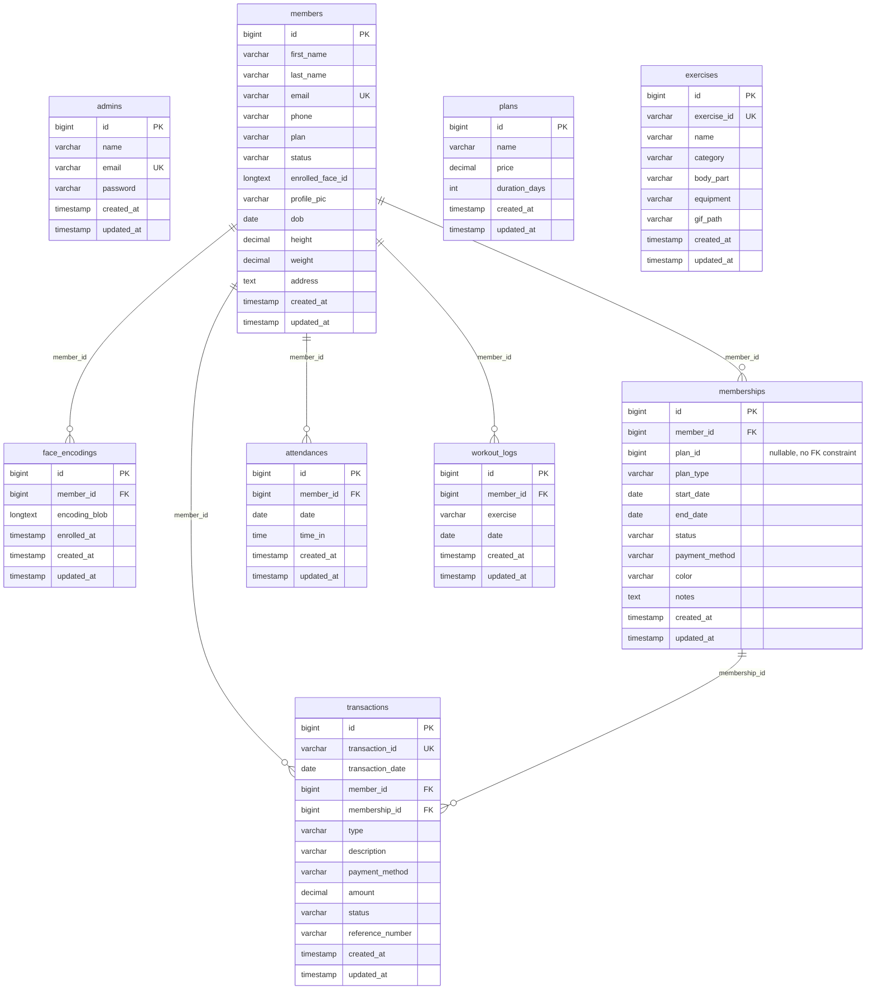

# 4.2-F Physical Entity-Relationship / Database Diagram

This section presents the **Physical Entity-Relationship Diagram (Database Diagram)** for the **IoT-Based Gym Management System with Facial Recognition Attendance and Gesture-Based Program Monitoring for Double Alpha Fitness Gym**.

---

## 1. Physical Entity-Relationship Diagram (PRESENT)

The physical ERD represents the actual MySQL relational database structure implemented in the Laravel backend. It details table names, column specifications, physical data types, primary keys (PK), foreign keys (FK), unique constraints (UK), and relational cardinalities.

**Figure 4.5.** Physical Entity-Relationship Diagram for Double Alpha Fitness Gym.

---

## 2. Comprehensive Data Dictionary (Database Schema)

The following tables define the physical specifications for all 9 database tables implemented in MySQL:

### Table 1: `admins`
Stores administrative authentication credentials for the Gym Owner / Coach.

| Column Name | Data Type | Constraints | Nullable | Description |
|---|---|---|:---:|---|
| `id` | `BIGINT UNSIGNED` | Primary Key, Auto Increment | No | Unique identifier for admin account |
| `name` | `VARCHAR(255)` | None | No | Full name of the administrator |
| `email` | `VARCHAR(255)` | Unique Key | No | Registered login email address |
| `password` | `VARCHAR(255)` | Bcrypt Hash | No | Encrypted authentication password |
| `created_at` | `TIMESTAMP` | None | Yes | Record creation timestamp |
| `updated_at` | `TIMESTAMP` | None | Yes | Last profile update timestamp |

---

### Table 2: `members`
Stores member demographic, contact, status, and anthropometric metrics.

| Column Name | Data Type | Constraints | Nullable | Description |
|---|---|---|:---:|---|
| `id` | `BIGINT UNSIGNED` | Primary Key, Auto Increment | No | Unique identifier for the member |
| `first_name` | `VARCHAR(255)` | None | No | Member's given name |
| `last_name` | `VARCHAR(255)` | None | No | Member's family name |
| `email` | `VARCHAR(255)` | Unique Key | No | Contact email address |
| `phone` | `VARCHAR(255)` | None | No | Mobile phone number |
| `plan` | `VARCHAR(255)` | Default: 'None' | No | Summary plan label |
| `status` | `VARCHAR(255)` | Default: 'Active', Indexed | No | Membership status (Active / Inactive) |
| `enrolled_face_id` | `LONGTEXT` | None | Yes | WebRTC face capture image path or token |
| `profile_pic` | `VARCHAR(255)` | None | Yes | Uploaded avatar image filename |
| `dob` | `DATE` | None | Yes | Date of birth for age calculation |
| `height` | `DECIMAL(5,2)` | None | Yes | Measured height in centimeters (e.g. 175.50) |
| `weight` | `DECIMAL(5,2)` | None | Yes | Measured weight in kilograms (e.g. 68.20) |
| `address` | `TEXT` | None | Yes | Residential address |
| `created_at` | `TIMESTAMP` | Indexed | Yes | Registration timestamp |
| `updated_at` | `TIMESTAMP` | None | Yes | Profile modification timestamp |

---

### Table 3: `face_encodings`
Stores 128-dimensional biometric facial embedding vectors for OpenCV/dlib matching.

| Column Name | Data Type | Constraints | Nullable | Description |
|---|---|---|:---:|---|
| `id` | `BIGINT UNSIGNED` | Primary Key, Auto Increment | No | Unique encoding record ID |
| `member_id` | `BIGINT UNSIGNED` | Foreign Key $\rightarrow$ `members.id` (Cascade) | No | Linked member identity |
| `encoding_blob` | `LONGTEXT` | None | No | 128-d floating point facial array |
| `enrolled_at` | `TIMESTAMP` | Default: Current Timestamp | No | Biometric capture timestamp |
| `created_at` | `TIMESTAMP` | None | Yes | Record creation timestamp |
| `updated_at` | `TIMESTAMP` | None | Yes | Record modification timestamp |

---

### Table 4: `plans`
Defines available gym membership packages, rates, and validity durations.

| Column Name | Data Type | Constraints | Nullable | Description |
|---|---|---|:---:|---|
| `id` | `BIGINT UNSIGNED` | Primary Key, Auto Increment | No | Unique plan tier ID |
| `name` | `VARCHAR(255)` | None | No | Plan name (Daily, Monthly, Annual, With Coach) |
| `price` | `DECIMAL(8,2)` | None | No | Cost in Philippine Pesos (PHP) |
| `duration_days` | `INT` | None | No | Validity duration (1, 30, 365 days) |
| `created_at` | `TIMESTAMP` | None | Yes | Record creation timestamp |
| `updated_at` | `TIMESTAMP` | None | Yes | Record modification timestamp |

---

### Table 5: `memberships`
Tracks member subscription validity periods and renewal statuses.

| Column Name | Data Type | Constraints | Nullable | Description |
|---|---|---|:---:|---|
| `id` | `BIGINT UNSIGNED` | Primary Key, Auto Increment | No | Unique subscription pass ID |
| `member_id` | `BIGINT UNSIGNED` | Foreign Key $\rightarrow$ `members.id` (Cascade), Indexed | No | Subscriber ID |
| `plan_id` | `BIGINT UNSIGNED` | No formal FK constraint (plain nullable column) | Yes | Subscribed pricing tier reference (soft link to `plans`) |
| `plan_type` | `VARCHAR(255)` | None | No | Snapshot of plan name at purchase |
| `start_date` | `DATE` | None | No | Subscription start date |
| `end_date` | `DATE` | Indexed | No | Expiration date |
| `status` | `VARCHAR(255)` | Default: 'Active', Indexed | No | Status (Active / Expired) |
| `payment_method` | `VARCHAR(255)` | Default: 'Cash' | No | Payment method used (Cash, GCash, Maya) |
| `color` | `VARCHAR(255)` | Default: '#f59e0b' | No | Calendar visual color badge |
| `notes` | `TEXT` | None | Yes | Administrative or coaching notes |
| `created_at` | `TIMESTAMP` | Indexed | Yes | Subscription purchase timestamp |
| `updated_at` | `TIMESTAMP` | None | Yes | Status update timestamp |

---

### Table 6: `transactions`
Provides an audit-proof financial ledger for cash, GCash, and Maya transactions.

| Column Name | Data Type | Constraints | Nullable | Description |
|---|---|---|:---:|---|
| `id` | `BIGINT UNSIGNED` | Primary Key, Auto Increment | No | Internal transaction ID |
| `transaction_id` | `VARCHAR(255)` | Unique Key | No | Formatted transaction code (e.g., TXN-001) |
| `transaction_date` | `DATE` | Indexed | No | Date of financial settlement |
| `member_id` | `BIGINT UNSIGNED` | Foreign Key $\rightarrow$ `members.id` (Set Null), Indexed | Yes | Member who paid (null for walk-in guests) |
| `membership_id` | `BIGINT UNSIGNED` | Foreign Key $\rightarrow$ `memberships.id` (Set Null) | Yes | Specific subscription period linked to payment |
| `type` | `VARCHAR(255)` | None | No | Transaction category (Subscription Payment, Fee) |
| `description` | `VARCHAR(255)` | None | Yes | Transaction details and plan description |
| `payment_method` | `VARCHAR(255)` | None | No | Payment channel (Cash, GCash, Maya) |
| `amount` | `DECIMAL(10,2)` | None | No | Amount paid in PHP |
| `status` | `VARCHAR(255)` | Default: 'Complete', Indexed | No | Settlement status (Complete / Pending / Refund) |
| `reference_number` | `VARCHAR(255)` | None | Yes | E-wallet reference or handwritten receipt number |
| `created_at` | `TIMESTAMP` | None | Yes | Entry timestamp |
| `updated_at` | `TIMESTAMP` | None | Yes | Modification timestamp |

---

### Table 7: `attendances`
Records automated check-in timestamps produced by the facial recognition camera.

| Column Name | Data Type | Constraints | Nullable | Description |
|---|---|---|:---:|---|
| `id` | `BIGINT UNSIGNED` | Primary Key, Auto Increment | No | Attendance entry ID |
| `member_id` | `BIGINT UNSIGNED` | Foreign Key $\rightarrow$ `members.id` (Cascade), Indexed | No | Recognized member |
| `date` | `DATE` | Indexed | No | Date of gym visit |
| `time_in` | `TIME` | None | No | Exact arrival time timestamp |
| `created_at` | `TIMESTAMP` | None | Yes | Log generation timestamp |
| `updated_at` | `TIMESTAMP` | None | Yes | Log update timestamp |

---

### Table 8: `workout_logs`
Records exercise sessions monitored via camera pose estimation or coach assignment.

| Column Name | Data Type | Constraints | Nullable | Description |
|---|---|---|:---:|---|
| `id` | `BIGINT UNSIGNED` | Primary Key, Auto Increment | No | Workout log ID |
| `member_id` | `BIGINT UNSIGNED` | Foreign Key $\rightarrow$ `members.id` (Cascade) | No | Athlete executing exercise |
| `exercise` | `VARCHAR(255)` | None | No | Exercise name or task status label |
| `date` | `DATE` | None | No | Workout execution date |
| `created_at` | `TIMESTAMP` | None | Yes | Record creation timestamp |
| `updated_at` | `TIMESTAMP` | None | Yes | Record update timestamp |

---

### Table 9: `exercises`
Stores pre-loaded reference workouts mapped to frontend demonstration animations.

| Column Name | Data Type | Constraints | Nullable | Description |
|---|---|---|:---:|---|
| `id` | `BIGINT UNSIGNED` | Primary Key, Auto Increment | No | Internal exercise ID |
| `exercise_id` | `VARCHAR(255)` | Unique Key | No | 4-digit standardized code (e.g. 0001, 0002) |
| `name` | `VARCHAR(255)` | None | No | Exercise title (e.g. 3/4 Sit-up) |
| `category` | `VARCHAR(255)` | None | Yes | Muscle group category |
| `body_part` | `VARCHAR(255)` | None | Yes | Targeted anatomical body part |
| `equipment` | `VARCHAR(255)` | None | Yes | Required gym apparatus (barbell, body weight) |
| `gif_path` | `VARCHAR(255)` | None | No | File path to frontend animated demonstration GIF |
| `created_at` | `TIMESTAMP` | None | Yes | Import timestamp |
| `updated_at` | `TIMESTAMP` | None | Yes | Update timestamp |

---

> [!NOTE]
> The complete narrative explanation complying with the **INTRODUCE $\rightarrow$ PRESENT $\rightarrow$ EXPLAIN $\rightarrow$ INTERPRET $\rightarrow$ CONNECT** format is located in the companion documentation file:  
> 📄 **[Physical Entity-Relationship Diagram docs.md](./Physical%20Entity-Relationship%20Diagram%20docs.md)**
