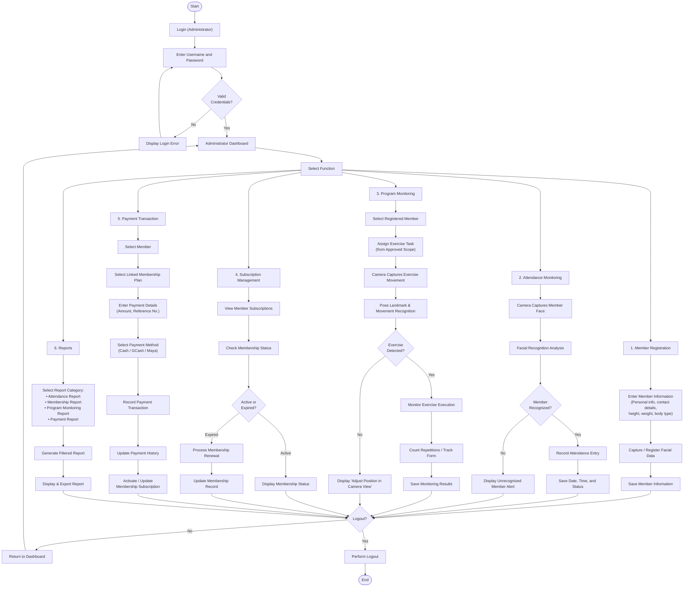

# 4.2-A System Process Flow Diagram

This section presents the updated System Process Flow Diagram for the Camera-Based Gym Management System for Double Alpha Fitness Gym. The diagram was developed from the requirements gathering and analysis phase, which incorporated findings from interviews with the gym owner, staff observations, and the evaluation of existing paper-based gym records. 

It illustrates the end-to-end operational flow executed by the System Administrator (Gym Owner / Authorized Staff), spanning initial authentication, routine multi-module gym operations, automated decision branches, and secure session termination.

---

## 1. System Process Flow Diagram (Mermaid Render)

**Figure 4.1.** Updated System Process Flow Diagram for the Camera-Based Gym Management System for Double Alpha Fitness Gym.

---

## 2. Process Narrative (Chapter 4 Standard)

### A. Narrative Walkthrough (EXPLAIN)
The process flow begins when the administrator opens the gym management system and inputs their administrative username and password. The system checks the credentials against registered administrative accounts. If the credentials do not match, the system displays an authentication error message and prompts the administrator to re-enter their credentials. Once successfully authenticated, the system redirects the administrator to the main Administrator Dashboard.

From the dashboard, the administrator can navigate to any of the system's six operational modules:

1. **Member Registration Module:** The administrator inputs member profile details, contact information, and anthropometric data (height, weight, and body type classification: Ectomorph, Mesomorph, or Endomorph). The system then activates the camera to capture and enroll facial biometric data before storing the finalized member profile in the database.
2. **Attendance Monitoring Module:** The camera stream continuously detects members entering the gym facility. The facial recognition engine compares captured features against the enrolled biometric database. If a match is verified, the system automatically records the attendance event with a verified timestamp. If the face is not recognized, the system triggers an unrecognized member notice, preventing unauthorized attendance logging.
3. **Program Monitoring Module:** The administrator selects a registered member and assigns a specific workout task chosen strictly from the approved exercise scope. When the member performs the assigned workout, the camera and computer vision engine analyze body landmarks. If landmark visibility is obscured or the exercise cannot be detected, the system prompts the member to adjust their position within the camera frame. When recognized correctly, the system tracks movement form, increments repetition counts in real time, and logs the finalized workout session data.
4. **Subscription Management Module:** The administrator checks the membership status of members. If the subscription is active, the valid status and remaining plan validity are presented. If the subscription is expired, the administrator initiates a renewal workflow and updates the active subscription validity.
5. **Payment Transaction Module:** The administrator selects the member, links the specific membership plan, enters the transaction amount and reference details, and specifies the payment channel (Cash, GCash, or Maya). After saving the payment, the transaction is added to the historical ledger, and the system automatically activates or extends the member's subscription status.
6. **Reports Module:** The administrator selects among attendance, membership, program monitoring, and payment transaction reports. The system aggregates the corresponding data based on date ranges or filters, and displays the structured summary for operational review or export.

Following the completion of any module activity, the administrator is presented with a session check. The administrator may either return to the main dashboard to execute additional tasks or log out to safely terminate the session.

### B. Meaning and Operational Impact (INTERPRET)
The updated process flow demonstrates the transition of Double Alpha Fitness Gym from disjointed manual operations into a cohesive, automated system. Critical manual bottlenecks—such as manual sign-in sheets, visual inspection of workout repetitions, physical verification of renewal dates, and paper receipts—are replaced by automated validation rules. Every decision diamond (credential check, facial recognition match, pose detection verification, and membership validity check) ensures data integrity before records are updated.

### C. Alignment with Study Objectives (CONNECT)
This flow aligns directly with the general and specific objectives stated in Chapter 1 of the study. Specifically, it operationalizes:
- **Biometric Attendance Tracking:** Ensuring touchless, verified logging without buddy punching.
- **Computer-Vision-Assisted Program Monitoring:** Providing structured exercise assignment and repetition counting.
- **Automated Membership and Subscription Tracking:** Eliminating manual calculation of expiration dates.
- **Accurate Multi-Channel Payment Recording:** Supporting modern digital payment recording (GCash/Maya) alongside cash while immediately linking revenue to active memberships.

---

## 3. Summary of Applied Fixes (Audit Trail)

| # | Fix Item | Module Affected | Previous Flaw | Applied Correction |
|---|---|---|---|---|
| **1** | Anthropometric Data Label | Module 1: Registration | Labeled ambiguously as `"bodydata"` | Changed to `"personal info, contact details, height, weight, body type"` |
| **2** | Exercise Task Assignment | Module 3: Program Monitoring | Jumped straight to camera capture without member or exercise selection | Added `"Select Registered Member"` and `"Assign Exercise Task (from Approved Scope)"` before camera capture |
| **3** | Exercise Recognition Decision | Module 3: Program Monitoring | Assumed 100% immediate detection without alternative feedback branch | Added decision diamond `"Exercise Detected?"` with `"No"` leading to `"Display 'Adjust Position in Camera View'"` |
| **4** | Membership Plan Selection | Module 5: Payment Transaction | Jumped from member selection directly to payment entry without plan context | Added `"Select Linked Membership Plan"` before entering payment amounts |
| **5** | Subscription Status Activation | Module 5: Payment Transaction | Ended at transaction history without updating member access status | Added `"Activate / Update Membership Subscription"` after transaction recording |
| **6** | Academic Narrative Compliance | Post-Diagram Documentation | Missing structured narrative required by Capstone Guidelines | Integrated complete INTRODUCE → PRESENT → EXPLAIN → INTERPRET → CONNECT academic sections |
