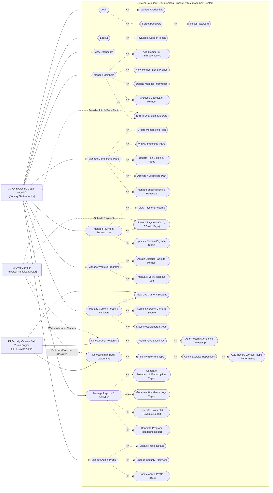
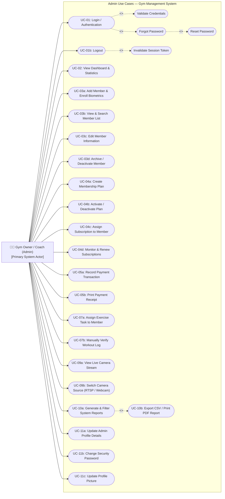
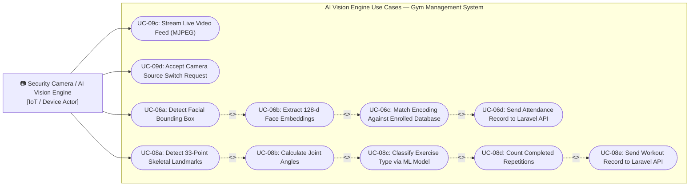
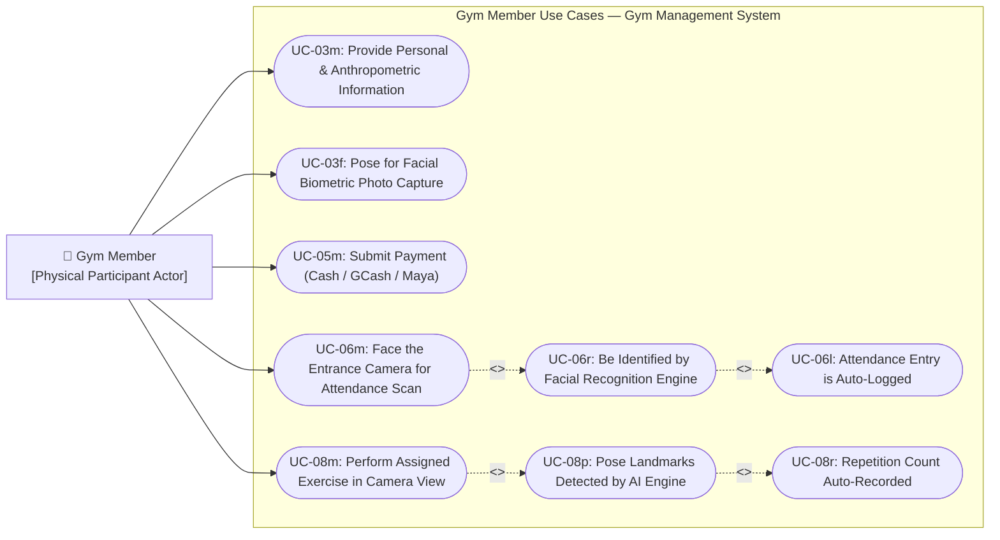

# System Use Case Specification
**Project Title:** Design and Development of an IoT-Based Gym Management System with Facial Recognition Attendance and Gesture-Based Program Monitoring for Double Alpha Fitness Gym  
**Document Version:** 2.3 (Capstone Documentation Standard)

---

## 1. System Overview — Combined Use Case Diagram

This diagram shows the complete system boundary with all three actors and their associated use cases.

---

## 2. System Actors and Roles

| Actor Name | Type | Description |
|---|---|---|
| **Gym Owner / Coach (Admin)** | **Primary System Actor** | The unified administrator and coach who directly uses the web system to manage members, plans, payments, workouts, cameras, and reports. |
| **Security Camera / AI Vision Engine** | **IoT / Device Actor** | The camera hardware (RTSP CCTV or USB webcam) and Python microservice that autonomously detects faces, tracks pose landmarks, counts repetitions, and streams video data. |
| **Gym Member** | **Participating Actor (Physical)** | Registered member who physically interacts with camera terminals for biometric attendance and gesture-guided workout sessions. They do not log into the web system. |

---

## 3. Actor 1 — Gym Owner / Coach (Admin)

### 3.1 Use Case Diagram

### 3.2 Admin Use Case Summary

| Use Case ID | Use Case Name | Description |
|:---:|---|---|
| **UC-01** | User Authentication & Authorization | Verifies admin credentials and establishes a secure session token. |
| **UC-02** | View Dashboard & Real-Time Statistics | Displays active members, daily attendance, expiring plans, pending tasks, and live activity. |
| **UC-03** | Member Registration & Biometric Enrollment | Creates member profiles, records anthropometrics, and enrolls facial reference images. |
| **UC-04** | Membership Plans & Subscription Tracking | Creates plans, assigns subscriptions, monitors status, and manages renewals. |
| **UC-05** | Payment Transaction Recording | Records Cash, GCash, Maya payments and generates printable receipts. |
| **UC-06** | Attendance Monitoring (Security Monitor) | Views the Security Monitor page where facial recognition results and attendance logs appear in real time. |
| **UC-07** | Program Exercise Assignment & Verification | Assigns selected program exercises to members and manually verifies completed workout logs. |
| **UC-09** | Camera Stream & Hardware Control | Views live feeds and switches between RTSP CCTV and USB webcam sources. |
| **UC-10** | System Reports & Analytics Generation | Filters and exports attendance, program monitoring, membership, and payment reports. |
| **UC-11** | Admin Profile & Security Settings | Updates profile details, password, and profile picture. |

### 3.3 Admin Formal Use Case Specifications

---

#### **UC-01: User Authentication & Authorization**
* **Primary Actor:** Gym Owner / Coach (Admin)
* **Preconditions:** Admin account exists in the database with a bcrypt-hashed password.
* **Main Flow:**
  1. Admin opens the system URL and is shown the Login screen.
  2. Admin enters registered email and password.
  3. System sends credentials to `POST /api/auth/login`.
  4. System generates a Laravel Sanctum bearer token and stores it in `localStorage`.
  5. System records login device info (device type, timestamp) for the Notification Bell security alert.
  6. System redirects Admin to the Dashboard (`/overview`).
* **Alternative Flows:**
  * *4a. Invalid Credentials:* System shows `"Invalid email or password"` error toast; email input is retained.
  * *4b. Forgot Password:* Admin clicks "Recovery?", provides registered email, receives reset token, and sets a new password.
  * *6a. Logout:* Admin clicks Logout; system calls `POST /api/auth/logout`, revokes the Sanctum token, and invalidates the session.
* **Postconditions:** Admin has authenticated access to all system modules.

---

#### **UC-02: View Dashboard & Real-Time Statistics**
* **Primary Actor:** Gym Owner / Coach
* **Preconditions:** Admin is logged in with a valid session token.
* **Main Flow:**
  1. Admin logs in and is automatically redirected to the Dashboard.
  2. System fetches live statistics via `GET /api/dashboard` (active members, today's attendance count, expiring subscriptions, pending AI tasks).
  3. Dashboard renders KPI summary cards, live attendance preview, and notification bell alerts.
  4. Notification bell auto-refreshes every 5 minutes: expiring memberships, upcoming events, login device activity, members without subscriptions, pending AI workout verifications.
* **Alternative Flows:**
  * *2a. API Timeout:* System displays cached last-known data and shows a subtle "Refreshing…" indicator.
* **Postconditions:** Admin has a full operational overview of all current gym activity.

---

#### **UC-03: Member Registration & Biometric Enrollment**
* **Primary Actor:** Gym Owner / Coach
* **Participating Actor:** Gym Member
* **Preconditions:** Admin is logged in; camera or file upload is available.
* **Main Flow:**
  1. Admin navigates to **Member Directory** and clicks **"Add Member"**.
  2. Admin enters personal details (Name, Contact, Gender, Emergency Contact).
  3. Admin inputs anthropometric data (Height in cm, Weight in kg; BMI is auto-calculated) and selects Body Type (Ectomorph, Mesomorph, Endomorph).
  4. Admin captures or uploads a front-facing facial reference photo of the member.
  5. Admin submits the form.
  6. Backend stores the record in MySQL and saves the face image in `/public/faces/`.
  7. Python AI Engine re-syncs enrolled face list via `GET /api/ai/members-faces` and recomputes 128-d face encodings.
* **Alternative Flows:**
  * *5a. Incomplete Required Fields:* System displays `"Please fill all required fields before proceeding"` and blocks submission.
* **Postconditions:** Member profile is active; facial biometric is enrolled for automated attendance.

---

#### **UC-04: Membership Plans & Subscription Tracking**
* **Primary Actor:** Gym Owner / Coach
* **Preconditions:** Admin is logged in.
* **Main Flow:**
  1. Admin navigates to **Subscriptions** page.
  2. Admin views existing plans. Admin clicks **"Add Plan"** to define a new tier (Name, Duration in days, Price).
  3. System stores the plan via `POST /api/plans`.
  4. Admin selects a member and assigns a plan via **"Add Subscription"**.
  5. System calculates expiry date from plan duration and saves via `POST /api/memberships`.
  6. Admin can activate/deactivate plans via the plan toggle (`POST /api/plans/bulk-update`).
* **Alternative Flows:**
  * *2a. Incomplete Plan Form:* System alerts `"Please fill all required fields"` and blocks submission.
  * *4a. Member Already Has Active Plan:* System warns admin before creating an overlapping subscription.
* **Postconditions:** Plan is saved; member subscription is active with correct start and expiry dates.

---

#### **UC-05: Payment Transaction Recording**
> **Implementation Note:** Receipt generation is an implementation-level output of payment confirmation. The paper's Payment Transaction Module covers "generating payment records and storing payment history" (manus.md), of which a printable receipt is the user-facing output artifact.
* **Primary Actor:** Gym Owner / Coach
* **Participating Actor:** Gym Member
* **Preconditions:** Admin is logged in; member exists in the database.
* **Main Flow:**
  1. Admin navigates to **Transactions** and clicks **"Add Transaction"**.
  2. Admin selects the member and linked membership plan.
  3. Admin selects payment method (Cash, GCash, Maya) and enters the amount and reference number.
  4. Admin submits the form.
  5. System saves the transaction via `POST /api/transactions`, activates the linked membership, and updates the subscription record.
  6. Admin can print a formal PDF receipt per transaction.
* **Alternative Flows:**
  * *4a. Incomplete Fields:* System displays `"Please enter all required information before saving"` and prevents submission.
  * *4b. Double-Click Guard:* `isSavingRef` lock prevents duplicate submissions on rapid repeated clicks.
* **Postconditions:** Payment record is saved; member subscription is immediately activated.

---

#### **UC-07: Program Exercise Assignment & Verification**
* **Primary Actor:** Gym Owner / Coach
* **Preconditions:** Admin is logged in; Gesture Monitor page is open; member is registered.
* **Main Flow:**
  1. Admin navigates to **Gesture Monitor** and selects a registered member.
  2. Admin chooses a selected exercise from the approved scope and clicks **"Assign Task"**.
  3. System saves the task via `POST /api/members/{id}/assign-task` with status `"ASSIGNED: [EXERCISE]"` and today's date.
  4. AI Engine detects completion and notifies `POST /api/ai/log-workout`.
  5. System strips `"ASSIGNED:"` prefix to mark the task as verified.
  6. If AI detection is ambiguous, admin manually verifies via `PUT /api/workouts/{id}/manual-verify`.
* **Alternative Flows:**
  * *3a. Same Task Already Assigned Today:* System silently skips the duplicate to prevent double logging.
  * *4a. Exercise Not Detected:* Task stays in `"ASSIGNED:"` status and appears in the Notification Bell as a Pending AI Task.
* **Postconditions:** Exercise is logged as completed in `workout_logs` with a verified timestamp.

---

#### **UC-09: Camera Stream & Hardware Control**
> **Scope Note:** Camera input supports both USB webcam and RTSP-based network cameras. Both are categorized under the "camera or webcam" IoT input defined in the approved system scope.
* **Primary Actor:** Gym Owner / Coach
* **Secondary Actor:** Security Camera / AI Vision Engine
* **Preconditions:** Python AI microservice is running on port 5000; camera hardware is connected.
* **Main Flow:**
  1. Admin opens **Security Monitor** or **Gesture Monitor** page.
  2. Page connects to the MJPEG stream at `http://127.0.0.1:5000/video_feed`.
  3. Live camera feed renders on the page.
  4. Admin clicks **"Switch to Webcam"** or **"Switch to CCTV"**.
  5. System sends `POST /switch_camera` with selected source to the AI Engine.
  6. AI Engine stops the current thread and reinitializes with the new source.
* **Alternative Flows:**
  * *3a. RTSP Unavailable:* AI Engine shows a branded standby placeholder frame instead of crashing.
  * *6a. Webcam Not Found:* Status badge shows `"Webcam device not detected"` and retains the prior source.
* **Postconditions:** Active camera source is streaming live frames.

---

#### **UC-10: System Reports & Analytics Generation**
* **Primary Actor:** Gym Owner / Coach
* **Preconditions:** Historical records exist in the database.
* **Main Flow:**
  1. Admin navigates to **Reports** page.
  2. Admin selects a Report Category: Attendance Logs, Program Monitoring, Membership Status, or Payment Transactions.
  3. Admin sets filters (Start Date, End Date, Search Keywords).
  4. System fetches filtered data via `GET /api/reports?start=&end=` and paginates to 7 rows per page.
  5. Admin exports via **"Export CSV"** or **"Print PDF"** (formal letterhead with KPI summary, data table, and sign-off lines).
* **Alternative Flows:**
  * *4a. No Records Found:* Table body displays `"No matching records found in the database."` — no error is thrown.
  * *5a. CSV Export Error:* Error is caught silently; `isExporting` state resets so the button recovers.
* **Postconditions:** Report is generated and available for download or print.

---

#### **UC-11: Admin Profile & Security Settings**
* **Primary Actor:** Gym Owner / Coach
* **Preconditions:** Admin is logged in with a valid session token.
* **Main Flow:**
  1. Admin navigates to **Admin Profile** page.
  2. System loads current profile data via `GET /api/admin/me`.
  3. Admin updates personal details (Name, Contact, Address) and saves via `PUT /api/admin/profile`.
  4. Admin clicks **"Change Password"**, enters current and new passwords.
  5. System validates match and strength, then updates the bcrypt-hashed password in the database.
  6. Admin uploads a new profile avatar via the photo upload control.
* **Alternative Flows:**
  * *5a. Passwords Do Not Match:* System shows `"New passwords do not match"` and clears password fields.
  * *5b. Wrong Current Password:* System shows `"Current password is incorrect"` and blocks the update.
  * *3a. Empty Required Fields:* System shows `"Please fill in all required fields"` and blocks submission.
* **Postconditions:** Admin profile and security credentials are updated.

---

## 4. Actor 2 — Security Camera / AI Vision Engine

### 4.1 Use Case Diagram

### 4.2 AI Vision Engine Use Case Summary

| Use Case ID | Use Case Name | Description |
|:---:|---|---|
| **UC-06** | Facial Recognition Attendance Tracking | Captures frames, extracts embeddings, matches enrolled faces, and sends attendance logs to the backend. |
| **UC-08** | Gesture-Based Movement & Repetition Monitoring | Detects pose landmarks, calculates joint angles, classifies exercises, counts reps, and logs workout results. |
| **UC-09** | Camera Stream & Live Feed Provision | Provides the MJPEG stream to the web UI and switches camera sources on admin request. |

### 4.3 AI Vision Engine Formal Use Case Specifications

---

#### **UC-06: Facial Recognition Attendance Tracking**
* **Primary Actor:** Security Camera / AI Vision Engine
* **Participating Actor:** Gym Member
* **Preconditions:** Camera stream is online; facial data is enrolled; AI microservice is running on port 5000.
* **Main Flow:**
  1. Gym Member approaches the entrance camera terminal.
  2. AI Engine captures live frames from the RTSP/Webcam stream using OpenCV.
  3. `face_recognition` library detects facial bounding boxes and extracts 128-dimensional embeddings.
  4. Engine computes Euclidean distance against enrolled encodings: Distance ≤ 0.50 = Match Verified.
  5. A confidence margin check of ≥ 0.035 gap between the top-2 candidates is required before confirming identity.
  6. Matched `member_id` and timestamp are sent to `POST /api/ai/log-attendance`.
  7. Backend logs the record in the `attendances` table; Security Monitor UI displays a recognition card.
* **Alternative Flows:**
  * *4a. Unknown Face / Distance > 0.50:* Face is tagged `"Unknown"` — no attendance log is created.
  * *5a. Ambiguous Match (Gap < 0.035):* Engine skips logging and waits for the next frame cycle.
  * *6a. Cooldown Active:* Duplicate attendance within 15 minutes is suppressed automatically.
* **Postconditions:** Member's gym entry is logged with a precise date and time.

---

#### **UC-08: Gesture-Based Movement & Repetition Monitoring**
* **Primary Actor:** Security Camera / AI Vision Engine
* **Participating Actor:** Gym Member
* **Supporting Actor:** Gym Owner / Coach
* **Preconditions:** Member is in camera view; MediaPipe Pose is initialized; workout model is loaded.
* **Main Flow:**
  1. Gym Member performs an exercise in front of the gesture camera station.
  2. MediaPipe Pose detects 33 3D skeletal landmark coordinates (shoulders, elbows, wrists, hips, knees, ankles).
  3. Engine extracts translation-invariant coordinates relative to the nose joint.
  4. Feature vectors are fed to the Sklearn classifier (`workout_model.pkl`) for exercise classification.
  5. State machine tracks joint angle inflection (DOWN → UP cycle) to increment the repetition counter.
  6. On task completion, engine sends `POST /api/ai/log-workout` to the Laravel backend.
  7. Backend matches the log to the pending assigned task and marks it as verified.
* **Alternative Flows:**
  * *4a. Low Confidence Prediction:* `workout_buffer deque(maxlen=7)` smooths noisy predictions before confirming exercise type.
  * *5a. Incomplete Rep (Angle Threshold Not Met):* Counter does not increment; member must complete the full motion arc.
  * *6a. Workout Cooldown Active:* If the same exercise was logged within 2 minutes, duplicate is suppressed.
* **Postconditions:** Exercise repetitions are stored in `workout_logs`; the assigned task is marked verified.

---

## 5. Actor 3 — Gym Member

### 5.1 Use Case Diagram

### 5.2 Gym Member Use Case Summary

| Use Case ID | Use Case Name | Member Role |
|:---:|---|---|
| **UC-03** | Member Registration & Biometric Enrollment | Provides personal info, anthropometrics, and poses for facial photo capture during admin-assisted registration. |
| **UC-05** | Payment Transaction Recording | Presents payment (Cash, GCash, Maya) to the admin for recording and confirmation. |
| **UC-06** | Facial Recognition Attendance Tracking | Faces the entrance camera; the AI Engine identifies them and auto-logs their attendance. |
| **UC-08** | Gesture-Based Movement & Repetition Monitoring | Performs assigned exercises in front of the gesture camera; reps are automatically tracked and recorded. |

### 5.3 Gym Member Formal Use Case Specifications

> **Note:** Gym Members do not have a web system login account. All member interactions are physical — occurring via camera terminals and admin-assisted processes. The system records their actions automatically.

---

#### **UC-03 (Member Role): Participate in Registration & Facial Enrollment**
* **Primary Actor:** Gym Member (Physical Participation)
* **Supporting Actor:** Gym Owner / Coach
* **Preconditions:** Member is physically present at the gym; Admin is conducting the registration session.
* **Main Flow:**
  1. Member provides personal information verbally or via a registration form (name, contact, gender, emergency contact).
  2. Member stands on the weighing scale; admin records height and weight; system calculates BMI.
  3. Admin selects the member's body type based on physical assessment (Ectomorph, Mesomorph, Endomorph).
  4. Member faces the camera or provides a clear front-facing photo for facial biometric enrollment.
  5. Admin submits the enrollment form; system saves the data and face image.
* **Alternative Flows:**
  * *4a. Blurry or Obstructed Photo:* Admin retakes the photo before submitting.
* **Postconditions:** Member's profile and facial biometric are registered and ready for attendance tracking.

---

#### **UC-05 (Member Role): Submit Payment for Membership**
* **Primary Actor:** Gym Member (Physical Participation)
* **Supporting Actor:** Gym Owner / Coach
* **Preconditions:** Member has an existing profile in the system.
* **Main Flow:**
  1. Member approaches the admin to renew or activate a membership plan.
  2. Member presents payment — Cash (handed over), GCash (shows QR confirmation), or Maya (shows transaction reference).
  3. Admin records the payment details in the Transactions page and confirms the transaction.
  4. System activates the linked subscription and generates a PDF receipt.
  5. Admin optionally prints or shares the receipt with the member.
* **Alternative Flows:**
  * *2a. Incorrect Amount:* Admin enters the actual amount received; transaction is flagged for manual review.
* **Postconditions:** Membership payment is recorded; subscription is active; member is cleared to use gym services.

---

#### **UC-06 (Member Role): Use Facial Recognition Attendance**
* **Primary Actor:** Gym Member (Physical Participation)
* **System Actor:** Security Camera / AI Vision Engine
* **Preconditions:** Member's facial biometric is enrolled; camera is active at the entrance.
* **Main Flow:**
  1. Member walks into the gym entrance and faces the CCTV/Webcam terminal.
  2. AI Vision Engine captures their face and extracts facial embeddings.
  3. Engine compares embeddings against the enrolled database and confirms identity.
  4. System automatically logs the member's attendance with the current date and time.
  5. Security Monitor page updates in real time showing the member's name, photo, and entry timestamp.
* **Alternative Flows:**
  * *3a. Face Not Recognized:* System labels the face as "Unknown" and does not log attendance. Member may inform admin for manual check-in or re-enrollment.
  * *3b. Member Recently Logged:* If already logged within the last 15 minutes, duplicate entry is suppressed.
* **Postconditions:** Member's gym entry is officially recorded with a precise timestamp.

---

#### **UC-08 (Member Role): Perform Gesture-Monitored Exercise**
* **Primary Actor:** Gym Member (Physical Participation)
* **System Actor:** Security Camera / AI Vision Engine
* **Supporting Actor:** Gym Owner / Coach
* **Preconditions:** Admin has assigned an exercise task to the member; gesture camera is active.
* **Main Flow:**
  1. Admin informs the member of the assigned exercise for the session.
  2. Member positions themselves in front of the gesture camera with full body visibility.
  3. Member performs the assigned exercise (e.g., Squats, Bicep Curls, Push-ups) at a natural pace.
  4. AI Engine tracks pose landmarks and counts each completed repetition automatically.
  5. Upon completing the required reps, the system records the workout and notifies the admin.
* **Alternative Flows:**
  * *4a. Body Not Fully Visible:* AI cannot accurately detect landmarks; member repositions for better camera coverage.
  * *4b. Wrong Exercise Detected:* If the AI misclassifies the movement, admin uses manual verification to approve the correct log.
* **Postconditions:** Workout session is recorded with exercise type and repetition count in the system.
