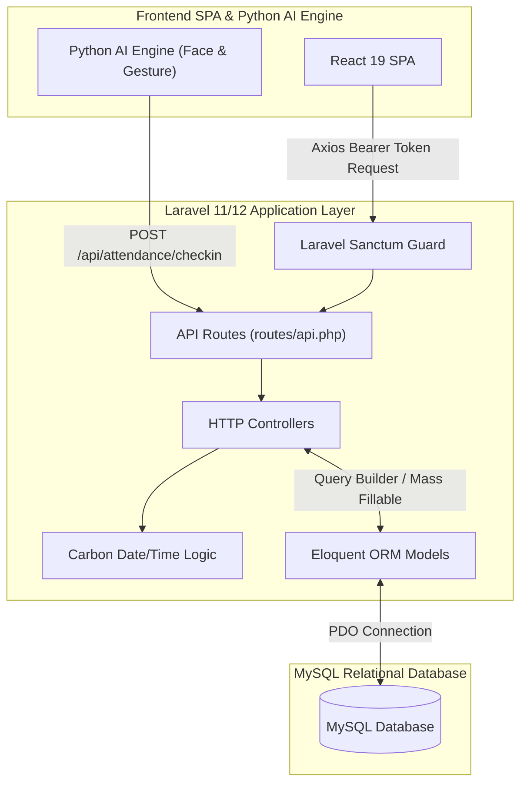
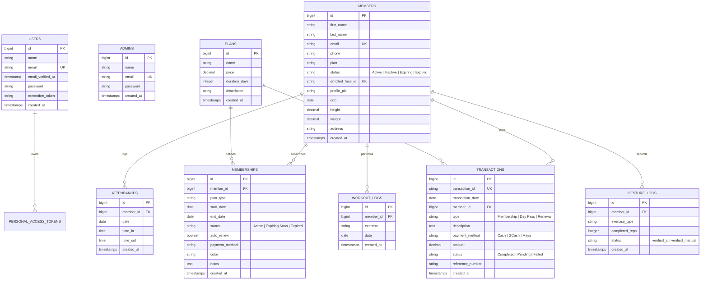

# Database Documentation & Laravel ORM Implementation

**Product Name:** Camera-Based Gym Management System with Facial Recognition Attendance and Gesture-Based Program Monitoring  
**Client:** Double Alpha Fitness Gym (Natumolan, Tagoloan, Misamis Oriental)  
**Document Version:** 1.0  
**Date:** September 2026  

---

## 1. Executive Database Overview

The **Camera-Based Gym Management System** utilizes a centralized **MySQL 8.0+** relational database to ensure high data integrity, strict transactional compliance, and seamless operational recordkeeping. All database operations, schema definitions, data migrations, seeding, and relationships are orchestrated through the **Laravel 11/12 Framework** using its **Eloquent ORM** engine and **Schema Builder**.

### Key Architectural Characteristics
* **Third Normal Form (3NF) Compliance**: Normalized tables eliminate redundant data duplication across members, subscriptions, payments, and attendance logs.
* **Declarative Migration Version Control**: All table structures are version-controlled via Laravel migration files (`database/migrations/`), enabling predictable database deployments and rollbacks.
* **Automated Audit Timestamps**: Every domain entity automatically maintains `created_at` and `updated_at` timestamps managed directly by Laravel.
* **Referential Integrity Constraints**: Strict foreign key cascades (`ON DELETE CASCADE`) and restrict rules (`ON DELETE RESTRICT`) prevent orphaned records in child tables (such as deleting a member with active transaction history).

---

## 2. How Laravel Interacts with the Database

Laravel forms the core business logic and API service layer between the **React SPA frontend**, **Python AI Vision Engine**, and **MySQL database**.



### 2.1. Laravel Migrations & Schema Builder
Laravel migrations serve as the database version control system. Tables are declared programmatically in PHP files:
* Columns are defined using fluent data types: `$table->id()`, `$table->foreignId()`, `$table->string()`, `$table->decimal()`, `$table->date()`, `$table->time()`, `$table->enum()`, and `$table->timestamps()`.
* Foreign keys explicitly declare relationship rules (e.g., `$table->foreignId('member_id')->constrained()->onDelete('cascade');`).

### 2.2. Eloquent ORM & Model Layer
Laravel Eloquent translates SQL tables into object-oriented PHP models located in `app/Models/`:
* **Mass Assignment Protection**: Models use the `$fillable` property to specify whitelisted attributes for create and update operations, preventing mass assignment security vulnerabilities.
* **Relationship Mapping**:
  * **One-to-Many (`1:N`)**: A `Member` has many `Attendance` logs, `Membership` records, `Transaction` payments, and `WorkoutLog` entries.
  * **BelongsTo (`N:1`)**: `Attendance`, `Membership`, `Transaction`, and `WorkoutLog` models define inverse `belongsTo(Member::class)` methods.

### 2.3. Automated Business Auditors & Logic Controls
Laravel leverages Eloquent queries and the `Carbon` date-time library to perform key automated operations:
1. **AI Inactivity Auditor (`MemberController::index`)**:
   * Inspects members marked as `Active`.
   * Queries `Attendance::where('member_id', $id)->orderBy('date', 'desc')->first()`.
   * If the last attendance timestamp is greater than 30 days old (`Carbon::now()->subDays(30)`), Laravel automatically updates `$member->status = 'Inactive'` and persists the change.
2. **Single Daily Attendance & Operating Hours Guard (`AttendanceController`)**:
   * Evaluates incoming AI check-in requests against official operational hours (**9:00 AM – 9:30 PM**).
   * Checks `Attendance::where('member_id', $id)->where('date', $today)->exists()` to enforce the single check-in per calendar day rule.
3. **Subscription Lifecycle & Renewal Tracker (`MembershipController`)**:
   * Continuously audits membership `end_date` attributes against `Carbon::today()`.
   * Automatically updates statuses to `Active`, `Expiring Soon` (within 7 days), or `Expired`.

### 2.4. Laravel Sanctum Authentication Tokens
API sessions are secured via **Laravel Sanctum**. Authentication details and bearer tokens are stored in the `personal_access_tokens` table. Each incoming request from the React admin portal is authenticated against active tokens before database access is granted.

---

## 3. Database Entity Relationship Diagram (ERD)



---

## 4. Complete Database Table Specifications

### 4.1. `members` Table
Stores gym member registration, physical body metrics, contact info, and biometric facial reference links.

| Column | Data Type | Nullable | Default | Description & Key Constraints |
| :--- | :--- | :--- | :--- | :--- |
| `id` | `BIGINT UNSIGNED` | No | Auto Increment | Primary Key |
| `first_name` | `VARCHAR(255)` | No | None | Member's first name |
| `last_name` | `VARCHAR(255)` | No | None | Member's last name |
| `email` | `VARCHAR(255)` | No | None | Unique email address (`UNIQUE`) |
| `phone` | `VARCHAR(15)` | No | None | Contact mobile number |
| `plan` | `VARCHAR(255)` | No | `'Basic'` | Active membership plan tier |
| `status` | `VARCHAR(255)` | No | `'Active'` | Status (`Active`, `Inactive`, `Expiring`, `Expired`) |
| `enrolled_face_id` | `VARCHAR(255)` | Yes | `NULL` | Biometric encoding lookup identifier |
| `profile_pic` | `VARCHAR(255)` | Yes | `NULL` | Public path to uploaded profile photo |
| `dob` | `DATE` | Yes | `NULL` | Date of birth |
| `height` | `DECIMAL(5,2)` | Yes | `NULL` | Height in centimeters (cm) |
| `weight` | `DECIMAL(5,2)` | Yes | `NULL` | Weight in kilograms (kg) |
| `address` | `TEXT` | Yes | `NULL` | Residential address |
| `created_at` | `TIMESTAMP` | Yes | `NULL` | Account creation timestamp |
| `updated_at` | `TIMESTAMP` | Yes | `NULL` | Account update timestamp |

---

### 4.2. `attendances` Table
Records touchless attendance check-ins identified by the Python Facial Recognition Engine.

| Column | Data Type | Nullable | Default | Description & Key Constraints |
| :--- | :--- | :--- | :--- | :--- |
| `id` | `BIGINT UNSIGNED` | No | Auto Increment | Primary Key |
| `member_id` | `BIGINT UNSIGNED` | No | None | Foreign Key referencing `members(id)` (`CASCADE`) |
| `date` | `DATE` | No | None | Check-in calendar date |
| `time_in` | `TIME` | No | None | Timestamp of entry verification |
| `time_out` | `TIME` | Yes | `NULL` | Timestamp of exit (optional) |
| `created_at` | `TIMESTAMP` | Yes | `NULL` | Record creation timestamp |
| `updated_at` | `TIMESTAMP` | Yes | `NULL` | Record update timestamp |

---

### 4.3. `memberships` Table
Tracks subscription plans, start/expiration dates, renewal preferences, and active statuses.

| Column | Data Type | Nullable | Default | Description & Key Constraints |
| :--- | :--- | :--- | :--- | :--- |
| `id` | `BIGINT UNSIGNED` | No | Auto Increment | Primary Key |
| `member_id` | `BIGINT UNSIGNED` | No | None | Foreign Key referencing `members(id)` (`CASCADE`) |
| `plan_type` | `VARCHAR(255)` | No | None | Plan tier name (e.g., Monthly VIP, Annual) |
| `start_date` | `DATE` | No | None | Subscription start date |
| `end_date` | `DATE` | No | None | Subscription expiration date |
| `status` | `VARCHAR(255)` | No | `'Active'` | Subscription state (`Active`, `Expiring Soon`, `Expired`) |
| `auto_renew` | `TINYINT(1)` | No | `0` | Boolean auto-renewal preference flag |
| `payment_method`| `VARCHAR(255)` | Yes | `NULL` | Primary payment method used |
| `color` | `VARCHAR(50)` | Yes | `'#3B82F6'` | UI badge color hex representation |
| `notes` | `TEXT` | Yes | `NULL` | Administrative staff notes |
| `created_at` | `TIMESTAMP` | Yes | `NULL` | Record creation timestamp |
| `updated_at` | `TIMESTAMP` | Yes | `NULL` | Record update timestamp |

---

### 4.4. `transactions` Table
Logs financial payment records for membership plans, renewals, and day passes.

| Column | Data Type | Nullable | Default | Description & Key Constraints |
| :--- | :--- | :--- | :--- | :--- |
| `id` | `BIGINT UNSIGNED` | No | Auto Increment | Primary Key |
| `transaction_id`| `VARCHAR(255)` | No | None | Unique public transaction reference (`UNIQUE`) |
| `transaction_date`| `DATE` | No | None | Date of financial transaction |
| `member_id` | `BIGINT UNSIGNED` | No | None | Foreign Key referencing `members(id)` (`CASCADE`) |
| `type` | `VARCHAR(255)` | No | None | Payment category (`Membership`, `Renewal`, `Day Pass`) |
| `description` | `TEXT` | Yes | `NULL` | Itemized line description |
| `payment_method`| `VARCHAR(255)` | No | `'Cash'` | Payment mode (`Cash`, `GCash`, `Maya`) |
| `amount` | `DECIMAL(10,2)`| No | None | Transaction currency amount (PHP ₱) |
| `status` | `VARCHAR(255)` | No | `'Completed'`| Transaction status (`Completed`, `Pending`, `Failed`) |
| `reference_number`| `VARCHAR(255)`| Yes | `NULL` | E-wallet reference code (GCash/Maya) |
| `created_at` | `TIMESTAMP` | Yes | `NULL` | Record creation timestamp |
| `updated_at` | `TIMESTAMP` | Yes | `NULL` | Record update timestamp |

---

### 4.5. `plans` Table
Master reference list defining available gym membership packages, duration, and pricing.

| Column | Data Type | Nullable | Default | Description & Key Constraints |
| :--- | :--- | :--- | :--- | :--- |
| `id` | `BIGINT UNSIGNED` | No | Auto Increment | Primary Key |
| `name` | `VARCHAR(255)` | No | None | Plan name (e.g., Student Pass, Monthly VIP) |
| `price` | `DECIMAL(10,2)`| No | None | Subscription price (PHP ₱) |
| `duration_days` | `INT` | No | `30` | Duration validity period in calendar days |
| `description` | `TEXT` | Yes | `NULL` | Feature breakdown and package details |
| `created_at` | `TIMESTAMP` | Yes | `NULL` | Record creation timestamp |
| `updated_at` | `TIMESTAMP` | Yes | `NULL` | Record update timestamp |

---

### 4.6. `workout_logs` & `gesture_logs` Tables
Tracks AI gesture-verified exercises, completed repetitions, and coach-assigned tasks.

| Column | Data Type | Nullable | Default | Description & Key Constraints |
| :--- | :--- | :--- | :--- | :--- |
| `id` | `BIGINT UNSIGNED` | No | Auto Increment | Primary Key |
| `member_id` | `BIGINT UNSIGNED` | No | None | Foreign Key referencing `members(id)` (`CASCADE`) |
| `exercise` | `VARCHAR(255)` | No | None | Exercise movement type (`Squat`, `Bicep Curl`, `Pushup`) |
| `completed_reps`| `INT` | No | `0` | AI-counted repetition quantity |
| `status` | `VARCHAR(50)` | No | `'verified_ai'`| Verification source (`verified_ai`, `verified_manual`) |
| `date` | `DATE` | No | None | Session date |
| `created_at` | `TIMESTAMP` | Yes | `NULL` | Record creation timestamp |
| `updated_at` | `TIMESTAMP` | Yes | `NULL` | Record update timestamp |

---

## 5. Practical Laravel Code Implementation Patterns

### 5.1. Creating a Member with Eloquent & File Handling
```php
public function store(Request $request)
{
    $validatedData = $request->validate([
        'first_name' => 'required|string|max:255',
        'last_name'  => 'required|string|max:255',
        'email'      => 'required|email|unique:members,email',
        'phone'      => 'required|string|max:15',
        'plan'       => 'required|string',
        'status'     => 'required|string',
        'profile_pic' => 'nullable|image|max:51200',
        'dob'        => 'nullable|date',
        'height'     => 'nullable|numeric',
        'weight'     => 'nullable|numeric',
        'address'    => 'nullable|string'
    ]);

    if ($request->hasFile('profile_pic')) {
        $file = $request->file('profile_pic');
        $filename = time() . '_' . $file->getClientOriginalName();
        $file->move(public_path('profiles'), $filename);
        $validatedData['profile_pic'] = '/profiles/' . $filename;
    }

    $member = Member::create($validatedData);

    return response()->json([
        'message' => 'Member registered successfully',
        'member'  => $member
    ], 201);
}
```

### 5.2. Querying Dashboard Revenue Analytics with Eloquent
```php
public function getDashboardMetrics()
{
    $totalMembers = Member::count();
    $activeMembers = Member::where('status', 'Active')->count();
    $todayAttendance = Attendance::where('date', Carbon::today()->toDateString())->count();

    $monthlyRevenue = Transaction::where('status', 'Completed')
        ->whereYear('transaction_date', Carbon::now()->year)
        ->whereMonth('transaction_date', Carbon::now()->month)
        ->sum('amount');

    return response()->json([
        'total_members'    => $totalMembers,
        'active_members'   => $activeMembers,
        'today_attendance' => $todayAttendance,
        'monthly_revenue'  => $monthlyRevenue
    ]);
}
```

---

## 6. Summary Matrix of Database Technology Stack

| Layer / Aspect | Selected Technology | Purpose |
| :--- | :--- | :--- |
| **Relational DBMS** | MySQL 8.0+ | Persistent centralized data storage |
| **ORM Framework** | Laravel Eloquent ORM | Object-relational mapping & relationships |
| **Schema Migration** | Laravel Schema Builder | Database version control & table structure |
| **Authentication DB** | Laravel Sanctum | Token storage in `personal_access_tokens` |
| **Data Seeders** | Laravel Database Seeders | Populating initial plans, admins, and mock data |
| **Date/Time Calculations**| Carbon Library | Operating hours checking & subscription expiry calculations |
