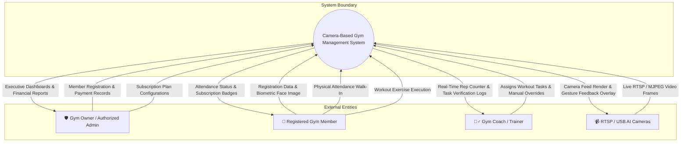
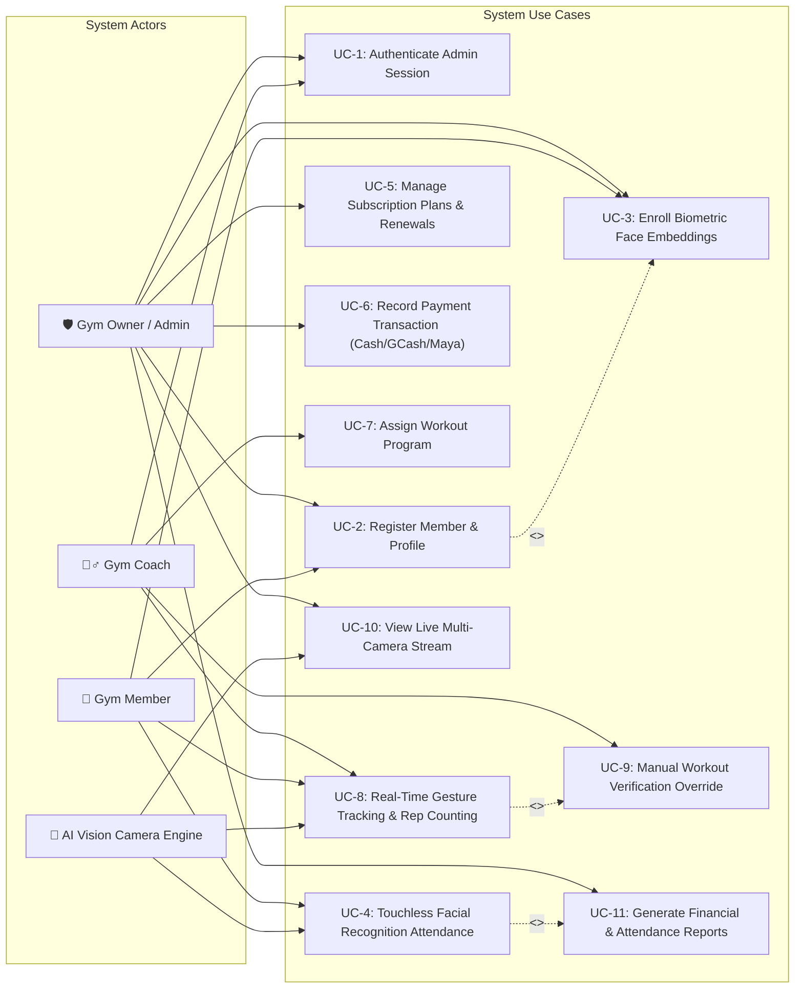
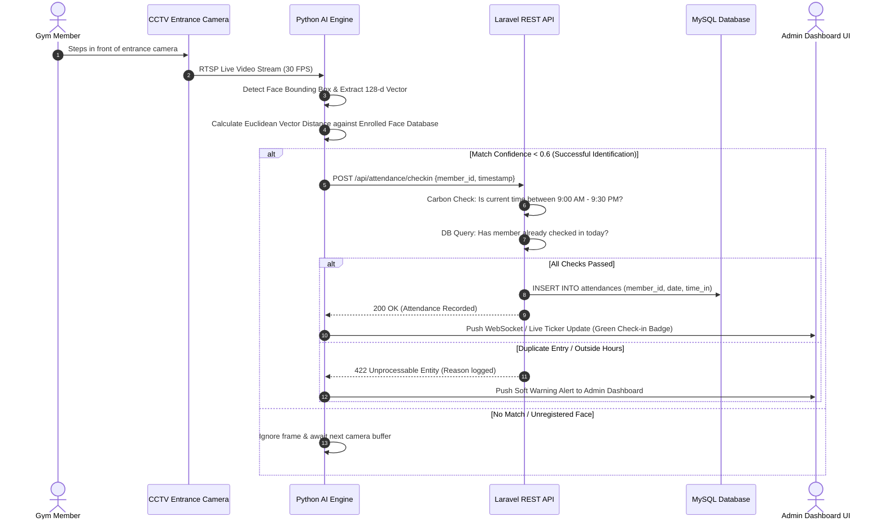
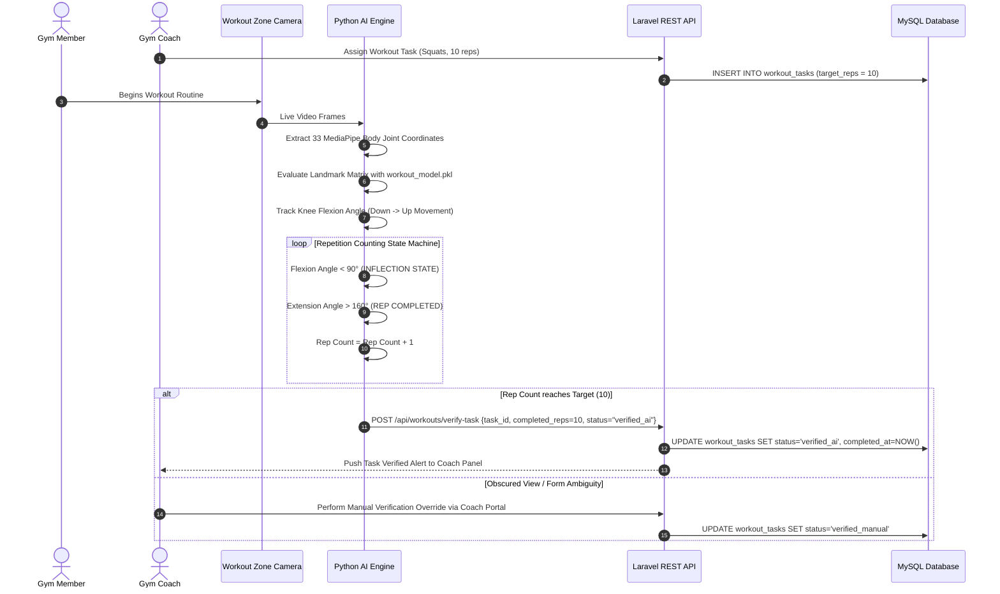

# System Diagrams & Visual Models Document

**Product Name:** Camera-Based Gym Management System with Facial Recognition Attendance and Gesture-Based Program Monitoring  
**Client:** Double Alpha Fitness Gym (Natumolan, Tagoloan, Misamis Oriental)  
**Document Version:** 1.0  
**Date:** September 2026  

---

## 1. Executive Summary

This document provides a comprehensive visual and structural modeling specification for the **Camera-Based Gym Management System with Facial Recognition Attendance and Gesture-Based Program Monitoring** at Double Alpha Fitness Gym. 

It encompasses all standard software engineering diagrams required for technical analysis, system design, capstone defense, and architecture validation:
1. **Input-Process-Output (IPO) Conceptual Model**
2. **System Context Diagram (Level 0 DFD)**
3. **Data Flow Diagram Level 1 (DFD Level 1)**
4. **Use Case Diagram (UCD) & Actor Specifications**
5. **System Architecture & Hardware Topology Diagram**
6. **Operational Sequence Diagrams** (Biometric Check-In, Gesture Verification, Payment Processing)

---

## 2. Input-Process-Output (IPO) Model

The Input-Process-Output (IPO) model illustrates the high-level operational data flow of the proposed system from initial data capture to final generated output reports.


---

## 3. System Context Diagram (Level 0 DFD)

The Context Diagram defines the system boundary, showcasing external entities interacting with the central **Camera-Based Gym Management System**.



---

## 4. Data Flow Diagram Level 1 (DFD Level 1)

DFD Level 1 decomposes the main system into six primary sub-processes and maps how data moves between external entities, processes, and central MySQL data stores.

```mermaid
flowchart TB
    %% External Entities
    ADMIN["🛡️ Gym Admin"]
    MEMBER["🧘 Gym Member"]
    COACH["🏋️‍♂️ Gym Coach"]
    CAM["📹 AI Cameras"]

    %% Processes
    P1["1.0\nMember Registration &\nFacial Enrollment"]
    P2["2.0\nFacial Recognition\nAttendance Logging"]
    P3["3.0\nGesture Program\nMonitoring & Rep Counting"]
    P4["4.0\nSubscription Lifecycle\nManagement"]
    P5["5.0\nPayment Transaction\nRecording"]
    P6["6.0\nSystem Reports &\nAnalytics Engine"]

    %% Data Stores
    D1[("D1: Members DB")]
    D2[("D2: Attendance Logs DB")]
    D3[("D3: Subscriptions DB")]
    D4[("D4: Payment Transactions DB")]
    D5[("D5: Workout Logs DB")]
    D6[("D6: Plans DB")]

    %% Process 1.0 Connections
    ADMIN -->|Member Details & Face Profile| P1
    P1 -->|Store Member Profile & Face ID| D1

    %% Process 2.0 Connections
    CAM -->|RTSP Video Frames| P2
    D1 -->|Fetch Enrolled Face Vectors| P2
    P2 -->|Log Verified Entry & Timestamp| D2
    P2 -->|Display Live Check-in Ticker| ADMIN

    %% Process 3.0 Connections
    COACH -->|Assign Workout Tasks| P3
    CAM -->|Video Stream (Pose Tracking)| P3
    P3 -->|Save AI Rep Count & Verification| D5
    D5 -->|Update Task Progress| COACH

    %% Process 4.0 Connections
    ADMIN -->|Configure Plan Tiers| D6
    D6 -->|Fetch Active Plan Rates| P4
    P4 -->|Create & Update Membership Status| D3
    D1 & D2 -->|Audit Activity / Expiration| P4

    %% Process 5.0 Connections
    ADMIN -->|Record Cash / GCash / Maya Payments| P5
    P5 -->|Insert Payment Ledger Entry| D4
    P5 -->|Update Active Subscription| D3

    %% Process 6.0 Connections
    D1 & D2 & D3 & D4 & D5 -->|Aggregate Operational Metrics| P6
    P6 -->|Render Financial & Attendance Reports| ADMIN
```

---

## 5. Use Case Diagram (UCD) & Actor Specifications

The Use Case Diagram highlights all functional interactions provided by the system, categorized by user roles and automated AI camera actors.



### Actor Description Matrix

| Actor | Type | Description & System Responsibilities |
| :--- | :--- | :--- |
| **Gym Owner / Admin** | Primary Human Actor | Full system access: manages member accounts, plan configurations, financial transactions, payment logging, system reporting, and live camera feed viewing. |
| **Gym Coach / Trainer** | Human Actor | Manages athlete workout routines, monitors live AI rep counting, assigns custom workout tasks, and performs manual verification overrides. |
| **Gym Member** | External Human Participant | Participates in registration, biometrics face enrollment, touchless attendance check-in, and assigned gesture workout sessions. |
| **AI Vision Camera Engine** | Automated Hardware/Software Actor | Captures RTSP/USB video feeds, executes facial recognition matching, extracts MediaPipe 3D pose landmarks, and calculates repetitions. |

---

## 6. System Architecture & Topology Model

```mermaid
flowchart TB
    subgraph Layer1 ["1️⃣ PRESENTATION LAYER (React 19 SPA)"]
        UI_DASH["Admin & Coach Dashboard"]
        UI_MEMBERS["Member Directory & Registration"]
        UI_ATTENDANCE["Live Attendance Feed"]
        UI_WORKOUTS["AI Workout & Rep Monitor"]
        UI_FINANCE["Payment & Invoicing Panel"]
    end

    subgraph Layer2 ["2️⃣ APPLICATION LAYER (Laravel REST API & Python AI Engine)"]
        subgraph Laravel_API ["Laravel 11/12 REST Services"]
            AUTH["Sanctum Auth Guard"]
            API_MEMBERS["Member Management API"]
            API_ATTENDANCE["Attendance Controller"]
            API_PAYMENTS["Payment & Billing API"]
            API_REPORTS["Analytics Generator"]
            CARBON_GUARD["Operating Hours & Expiry Guard"]
        end

        subgraph Python_AI ["Python 3.10+ AI Microservice Engine"]
            FLASK_SERVER["Flask Streaming API Server"]
            FACE_RECOGNITION["Face Recognition Engine (128-d Vector Match)"]
            MEDIAPIPE_POSE["MediaPipe Pose Estimator (33 Landmarks)"]
            ML_CLASSIFIER["Scikit-Learn Workout Classifier (workout_model.pkl)"]
            REP_STATE["Repetition State Machine"]
        end
    end

    subgraph Layer3 ["3️⃣ DATA LAYER (Centralized MySQL 8.0+)"]
        MYSQL_DB[("Centralized MySQL Database")]
        FILE_STORAGE["Local Profile Photo & Receipt Storage"]
    end

    subgraph Layer4 ["4️⃣ HARDWARE & DEVICE LAYER"]
        CCTV_CAM["Hikvision RTSP IP CCTV Cameras (Entrance & Gym Floor)"]
        USB_CAM["USB Webcams (Registration Desk)"]
    end

    %% Connections
    Layer1 <-->|HTTP / Axios REST API| Laravel_API
    Layer1 <-->|MJPEG Stream / Canvas Render| Python_AI
    
    Layer4 -->|RTSP Video Feed (Port 554)| Python_AI
    Layer4 -->|USB Video Capture| Python_AI

    Python_AI -->|POST /api/attendance/checkin| API_ATTENDANCE
    Python_AI -->|POST /api/workouts/verify-task| API_MEMBERS

    Laravel_API <-->|Eloquent PDO Queries| MYSQL_DB
    Laravel_API -->|Save Files| FILE_STORAGE
```

---

## 7. Operational Sequence Diagrams

### 7.1. Touchless Facial Recognition Attendance Check-In Sequence



---

### 7.2. Gesture Workout Verification & Rep Counting Sequence



---

## 8. Diagram Summary Reference Matrix

| Diagram Type | Primary Purpose | Key Components & Standards |
| :--- | :--- | :--- |
| **IPO Model** | Conceptual System Flow | Categorizes System Inputs, Core Processes, and Generated Outputs |
| **Context Diagram (DFD L0)** | System Boundary & Entities | Defines high-level interaction between Admin, Member, Coach, Camera & System |
| **DFD Level 1** | Process & Data Store Mapping | Decomposes system into 6 core processes interacting with 6 MySQL data tables |
| **Use Case Diagram (UCD)** | Functional User Roles | Maps 11 use cases across 4 primary actors (Admin, Coach, Member, AI Camera) |
| **System Architecture** | Technical Tier Composition | 4-Layer model (Presentation, Application REST/AI, Data Layer, Hardware Layer) |
| **Sequence Diagrams** | Step-by-Step Runtime Logic | Detail execution sequences for touchless check-in and gesture rep counting |
