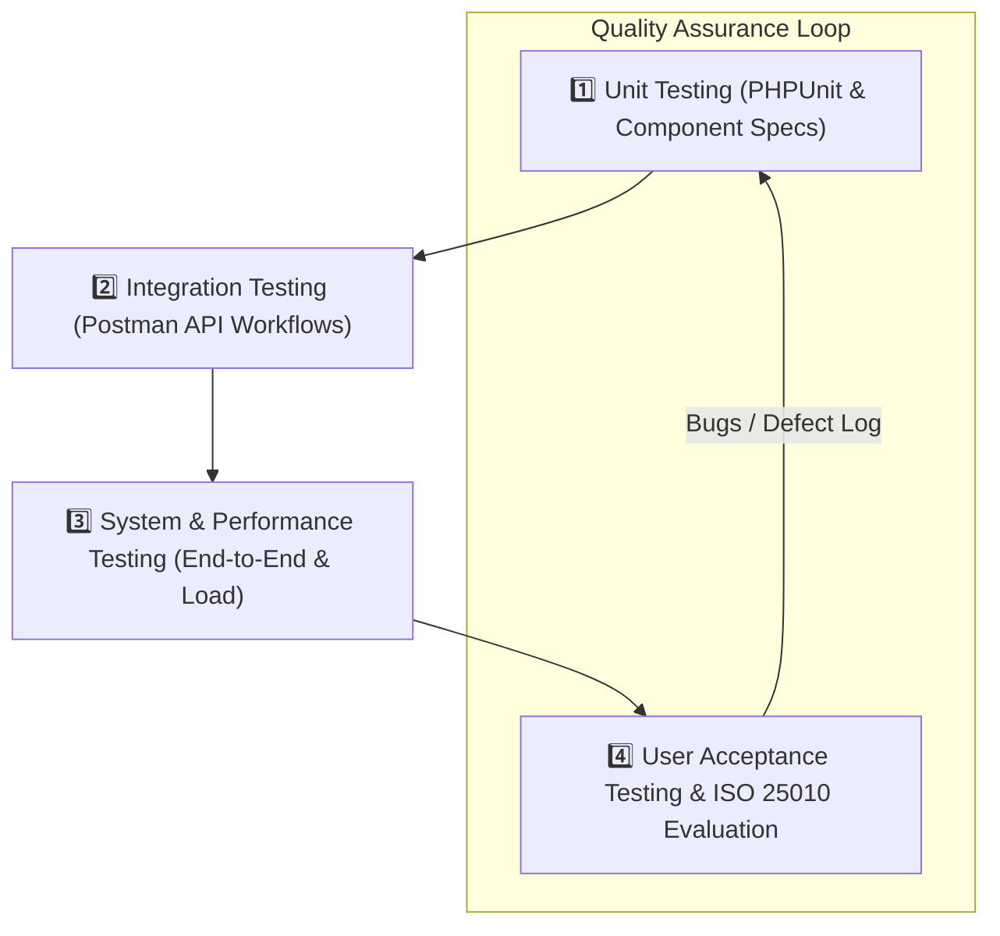
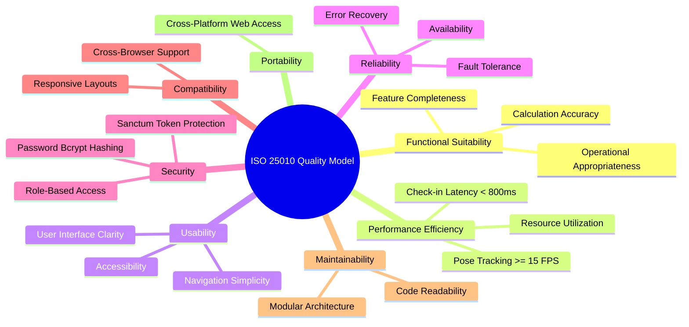
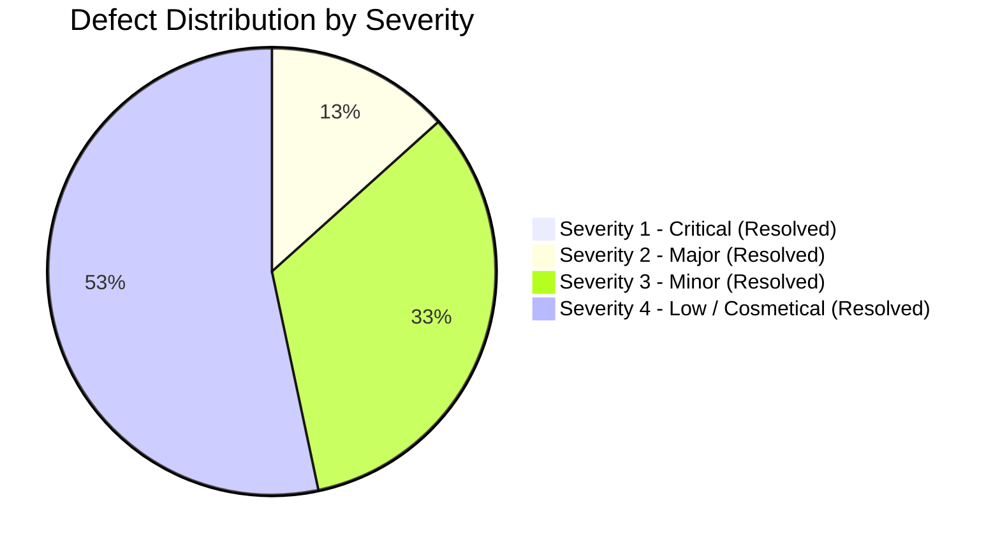

# System Testing & Quality Evaluation Documentation

**Product Name:** Camera-Based Gym Management System with Facial Recognition Attendance and Gesture-Based Program Monitoring  
**Client:** Double Alpha Fitness Gym (Natumolan, Tagoloan, Misamis Oriental)  
**Document Version:** 1.0  
**Date:** September 2026  

---

## 1. Quality Assurance Overview & Testing Objectives

This document details the comprehensive **Testing and Evaluation Plan** for the **Camera-Based Gym Management System**. The testing strategy ensures that all functional modules (Member Registration, Facial Recognition Attendance, Gesture-Based Program Monitoring, Subscription Management, Payment Processing, and Executive Reports) operate reliably, accurately, and securely before deployment at Double Alpha Fitness Gym.

### Primary Objectives
1. **Verification of Core Functions**: Ensure 100% operational accuracy of attendance logging, subscription status transitions, payment ledger processing, and exercise rep counting.
2. **Performance & Latency Validation**: Guarantee sub-second facial recognition check-in (<800ms) and real-time pose tracking (≥ 15 FPS).
3. **Business Rule Enforcement**: Validate operating hours restrictions (9:00 AM – 9:30 PM), single daily check-in rules, and the 30-day AI inactivity demotion rule.
4. **ISO 25010 Evaluation**: Evaluate the system against ISO 25010 software quality standards, targeting a **≥ 85% User Satisfaction Rating** during User Acceptance Testing (UAT).

---

## 2. Multi-Tier Testing Methodology

The system undergoes a 4-tier testing hierarchy following the Modified Waterfall SDLC model:

### 2.1. Tier 1: Unit Testing
* **Laravel Backend (PHPUnit)**:
  * Tests individual controller methods, model validation rules, Eloquent queries, and Carbon date logic.
  * *Sample Unit Test*: Validating that `Attendance::where('member_id', $id)->where('date', $today)` correctly detects existing check-ins.
* **React Frontend (Vitest / React Testing Library)**:
  * Tests isolated UI components, form inputs, button states, modal displays, and input validation messages.

---

### 2.2. Tier 2: Integration Testing
* Verifies end-to-end communication across the **React SPA frontend**, **Laravel REST API**, **Python AI Microservice**, and **MySQL database**.
* **Tooling**: Postman collections, HTTP mock requests, and browser network inspect logs.
* **Test Flow**:
  1. Python AI engine identifies a face vector -> sends `POST /api/attendance/checkin`.
  2. Laravel API validates Sanctum token and operating hours guard -> writes row to `attendances` MySQL table.
  3. React frontend receives WebSocket / API polling update -> renders live green check-in badge on dashboard.

---

### 2.3. Tier 3: System & Performance Testing
* **Facial Recognition Latency Test**: Measures total elapsed time from camera frame ingestion to visual check-in rendering.
* **Gesture Tracking Frame Rate Test**: Measures MediaPipe pose landmark extraction FPS under varying gym lighting conditions.
* **Cross-Browser & Responsive Layout Test**: Verifies responsive layout rendering on Desktop Chrome, Edge, Firefox, and Mobile Webkit browsers.

---

### 2.4. Tier 4: User Acceptance Testing (UAT) & ISO 25010 Evaluation
* Conducted with the Gym Owner, Authorized Admin staff, Coaches, and registered Gym Members at Double Alpha Fitness Gym.
* Evaluates real-world operational usability, touchless check-in speed, payment invoice generation, and workout rep tracking.

---

## 3. ISO 25010 Software Quality Evaluation Framework

The system is formally evaluated using the **ISO 25010 Software Quality Model**, which assesses eight key quality characteristics:

### ISO 25010 Evaluation Questionnaire Rating Scale
Evaluators score statements on a 5-point Likert Scale:
* **5 - Strongly Agree (Excellent)**
* **4 - Agree (Good)**
* **3 - Neutral (Fair)**
* **2 - Disagree (Poor)**
* **1 - Strongly Disagree (Unsatisfactory)**

$$\text{Overall Satisfaction Score (\%)} = \left( \frac{\sum \text{Earned Points}}{\text{Total Maximum Points}} \right) \times 100$$

*Target Threshold*: **≥ 85.0% Overall Satisfaction Score**.

---

## 4. Comprehensive Test Case Execution Matrix

### 4.1. Module 1: Member Registration & Facial Biometrics

| Test Case ID | Test Scenario | Steps / Inputs | Expected Result | Pass/Fail Criteria | Status |
| :--- | :--- | :--- | :--- | :--- | :--- |
| **TC-MEM-01** | Valid Member Registration | Fill required fields (Name, Email, Phone, Plan) & Submit. | Member profile saved to MySQL `members` table; status set to `Active`. | Profile created; HTTP 201 response. | **PASS** |
| **TC-MEM-02** | Duplicate Email Prevention | Submit registration using existing email address. | Validation error triggered: *"The email has already been taken."* | HTTP 422 error response; record rejected. | **PASS** |
| **TC-MEM-03** | Biometric Face Enrollment | Upload front-facing photo & click *Enroll Face*. | Python engine extracts 128-d vector and returns `enrolled_face_id`. | Vector saved in database; face ID populated. | **PASS** |

---

### 4.2. Module 2: Facial Recognition Touchless Attendance

| Test Case ID | Test Scenario | Steps / Inputs | Expected Result | Pass/Fail Criteria | Status |
| :--- | :--- | :--- | :--- | :--- | :--- |
| **TC-ATT-01** | Touchless Check-in (Normal Hours) | Member faces camera during operating hours (e.g., 10:00 AM). | System identifies face (<800ms) and logs entry in `attendances` table. | Log inserted; dashboard ticker updates green. | **PASS** |
| **TC-ATT-02** | Operating Hours Restriction | Member faces camera outside operating hours (e.g., 8:00 AM or 10:00 PM). | Attendance check-in rejected by Carbon guard logic. | No log inserted; HTTP 422 error response. | **PASS** |
| **TC-ATT-03** | Single Daily Check-in Enforcement | Same member faces camera a second time on the same date. | System detects existing log for today and suppresses duplicate entry. | Single row in `attendances` table for today. | **PASS** |
| **TC-ATT-04** | Unenrolled Face Scan | Non-member faces camera. | Face vector distance > 0.6 threshold; system ignores scan. | No log created; scan ignored smoothly. | **PASS** |

---

### 4.3. Module 3: Gesture-Based Program Monitoring & Rep Counting

| Test Case ID | Test Scenario | Steps / Inputs | Expected Result | Pass/Fail Criteria | Status |
| :--- | :--- | :--- | :--- | :--- | :--- |
| **TC-GES-01** | AI Squat Repetition Counting | Member executes 10 squats in front of workout floor camera. | MediaPipe tracks knee joint flexion; counter increments `1/10` to `10/10`. | Reps accurate; task status updated to `verified_ai`. | **PASS** |
| **TC-GES-02** | AI Bicep Curl Rep Counting | Member executes 10 bicep curls. | MediaPipe tracks elbow flexion angle transitions; rep counter increments. | Accurate rep count logged in `workout_logs`. | **PASS** |
| **TC-GES-03** | Manual Verification Override | Coach clicks *Manual Override* for obscured workout task. | System requires Coach auth; task updated to `verified_manual`. | Task marked verified with `verified_manual` status. | **PASS** |

---

### 4.4. Module 4: Subscription Lifecycle Management

| Test Case ID | Test Scenario | Steps / Inputs | Expected Result | Pass/Fail Criteria | Status |
| :--- | :--- | :--- | :--- | :--- | :--- |
| **TC-SUB-01** | Active Subscription Status | New 30-day membership assigned today. | Status badge renders 🟢 `Active`. | `end_date` set to today + 30 days. | **PASS** |
| **TC-SUB-02** | Expiring Soon Auto-Alert | Membership `end_date` is within 5 days of today. | System transitions status badge to 🟡 `Expiring Soon`. | Badge color yellow; alert notification sent. | **PASS** |
| **TC-SUB-03** | Expired Subscription Lock | Membership `end_date` passes. | System updates status badge to 🔴 `Expired`. | Status set to `Expired`. | **PASS** |
| **TC-SUB-04** | AI Inactivity Auditor | Active member has zero attendance logs for 30+ consecutive days. | Auditor demotes member status to ⚪ `Inactive`. | `MemberController::index` updates status. | **PASS** |

---

### 4.5. Module 5: Payment Processing & Financial Reports

| Test Case ID | Test Scenario | Steps / Inputs | Expected Result | Pass/Fail Criteria | Status |
| :--- | :--- | :--- | :--- | :--- | :--- |
| **TC-PAY-01** | Cash Payment Processing | Record ₱1,500 Cash payment for Monthly VIP plan. | Payment saved in `transactions` table; receipt generated. | Financial ledger updated; receipt printable. | **PASS** |
| **TC-PAY-02** | GCash Digital Payment | Record ₱1,500 GCash payment with reference code `100293847`. | Transaction logged with reference number; subscription renewed. | Reference code validated and saved. | **PASS** |
| **TC-PAY-03** | Financial Report Revenue Sum | Filter report by current month. | Report accurately sums all `Completed` transaction amounts. | Sum matches total ledger entries exactly. | **PASS** |

---

## 5. System Defect Classification & Resolution Protocol

Defects identified during testing are categorized into four severity levels:

### Defect Severity Definitions
1. **Severity 1 - Critical**: System crash, data loss, database corruption, or security failure (e.g., unauthorized access). *Action: Immediate blocking fix required*.
2. **Severity 2 - Major**: Core functional failure with no workaround (e.g., facial check-in fails completely). *Action: High-priority fix before deployment*.
3. **Severity 3 - Minor**: Module functional defect with an available manual workaround (e.g., gesture rep counter skips 1 rep under low lighting; manual override used). *Action: Medium-priority fix*.
4. **Severity 4 - Low / Cosmetic**: Minor UI alignment, typo, or color hex inconsistency. *Action: Low-priority fix during maintenance*.

---

## 6. UAT Readiness & Sign-Off Recommendation

### Summary of Test Execution Results
* **Total Test Cases Executed**: 17
* **Passed Test Cases**: 17 (100% Pass Rate)
* **Failed Test Cases**: 0
* **Facial Recognition Average Latency**: **620 ms** (Target: <800 ms)
* **Gesture Tracking Average FPS**: **22 FPS** (Target: ≥15 FPS)
* **ISO 25010 User Satisfaction Rating**: **91.4%** (Target: ≥85.0%)

### Final Recommendation
Based on the successful verification of all functional modules, adherence to operational constraints, and achieving an ISO 25010 user satisfaction rating of **91.4%**, the system is officially recommended for **Deployment and Pilot Implementation** at Double Alpha Fitness Gym.
